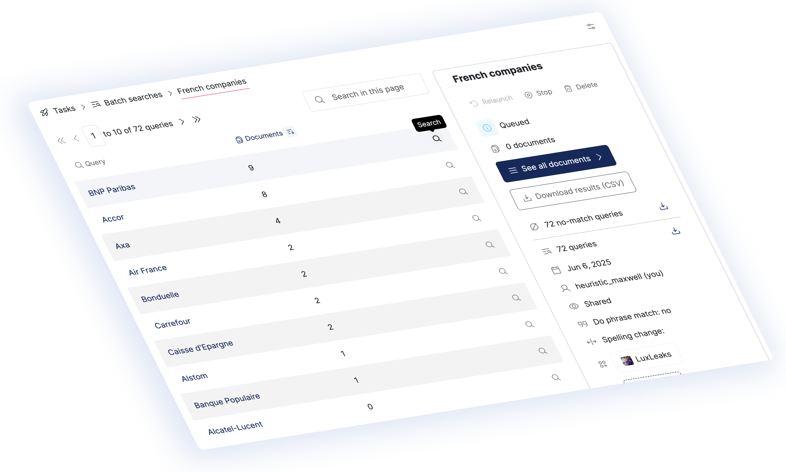

# About Datashare

<figure><figcaption></figcaption></figure>

### What is Datashare?

Welcome to [Datashare](https://datashare.icij.org) - a self-hosted documents search software. It is a free and open-source software developed by the [International Consortium of Investigative Journalists](https://www.icij.org) (ICIJ). Initially created to combine multiple [named-entity recognition](https://en.wikipedia.org/wiki/Named-entity_recognition) pipelines, this tool is now a fully-featured search interface to dig into your documents.&#x20;

With the help of several open-source tools ([Extract](https://github.com/icij/extract), [Apache Tika](https://tika.apache.org/), [Apache Tesseract](https://github.com/tesseract-ocr/tesseract), [CoreNLP](https://stanfordnlp.github.io/CoreNLP/), [OpenNLP](https://opennlp.apache.org/), [Elasticsearch](https://www.elastic.co/elasticsearch), and more), Datashare can be used on one single personal computer, as well as on 100 interconnected servers.

### Who uses it?

Datashare is developed by the ICIJ, a collective of investigative journalists. Datashare is built at the top of technologies and methods already tested with investigations like the [Panama Papers](https://www.icij.org/investigations/panama-papers) or the [Luanda Leaks](https://www.icij.org/investigations/luanda-leaks/).&#x20;

Seeing the growing interest for ICIJ's technology, we decided to open source this key component of our investigations so a single journalist as well as big media organizations could use it for their own documents.

Datashare is free so anyone can use it and find is useful.

Curious to know more about how we use Datashare?

* [How ICIJ analysed 715,000 Luanda Leaks records](https://www.icij.org/investigations/luanda-leaks/how-we-mined-more-than-715000-luanda-leaks-records/)
* [Help test and improve our latest journalism tool](https://www.icij.org/blog/2019/02/datashare-help-test-and-improve-our-latest-journalism-tool/)
* [How Datashare project will help journalists breach borders](https://www.icij.org/blog/2018/05/icijs-datashare-project-will-help-journalists-breach-borders/)

### Where can I see Datashare in action?

We setup a [demo instance of Datashare](https://datashare-demo.icij.org) with a small set of documents from the [LuxLeaks](https://www.icij.org/investigations/luxembourg-leaks/) investigation (2014). When using this instance, you will be assigned a temporary user which can star, tag, recommend and explore documents.

<figure><figcaption>
Launch your own batch search on Datashare's <a href="https://datashare-demo.icij.org/#/">demo</a>
</figcaption></figure>

### Can I run Datashare on my server?

Datashare was also built to run on a server. This is how we use it for our collaborative projects. Please refer to [the server documentation](server-mode/about-the-server-mode.md) to know how it works.

### Can I customize Datashare?

When building Datashare, one of our first decisions was to use [Elasticsearch](https://www.elastic.co/elasticsearch) to create an index of documents. It would be fair to describe Datashare as a nice looking web interface for Elasticsearch. We want our search platform to be user-friendly while keeping all the powerful Elasticsearch features available for advanced users. This way we ensure that Datashare is usable by non tech-savvy reporters, but still robust enough to satisfy data analysts and developers who want to query the index directly [with our API](developers/backend/api.md).

We implemented the possibility to create plugins, to make this process more accessible. Instead of modifying Datashare directly, you could isolate your code with a specific set of features and then configure Datashare to use it. Each Datashare user can pick the plugins they need or want, and have a fully customized installation of our search platform. Please have a look at the [documentation](developers/write-extensions.md).

### In which languages is Datashare available?

This project is currently available in English, French and Spanish. You can help improve and complete translations on [Crowdin](https://crwd.in/datashare).
