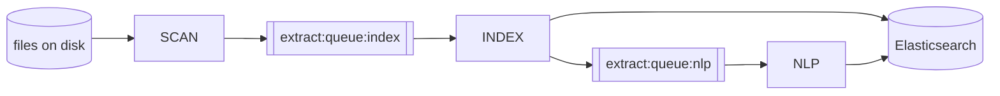

# CLI stages

Document processing in Datashare is a chain of **stages**. Each stage is a small program that consumes a queue and produces the next one, which is what lets you run them separately, later, or on several machines at once.

Stages are primarily meant for an instance that uses non-embedded services (an external Elasticsearch, database and key/value store). See [Embedded mode](../../local-mode/embedded-mode.md) for the default single-process configuration.

They are run with:

```bash
datashare stage run --stages SCAN,INDEX,NLP
```

Whatever order you list them in, stages always run in pipeline order.

## The stages

| Stage | Purpose | Reads from | Writes to |
| ----- | ------- | ---------- | --------- |
| [`SCAN`](scan.md) | Walk `--dataDir` and queue every file found | filesystem | queue |
| [`SCANIDX`](scanidx.md) | Record the paths already in an index into a report map | Elasticsearch | report map |
| [`DEDUPLICATE`](deduplicate.md) | Drop paths already seen in the queue | queue | queue |
| [`INDEX`](index.md) | Extract text, metadata, OCR and embedded documents | queue | Elasticsearch + queue |
| [`ENQUEUEIDX`](enqueueidx.md) | Push document ids from an existing index back onto a queue | Elasticsearch | queue |
| [`CATEGORIZE`](categorize.md) | Fill the `contentTypeCategory` field of indexed documents | queue | Elasticsearch + queue |
| [`NLP`](nlp.md) | Run named entity recognition over indexed documents | queue | Elasticsearch |
| [`CREATENLPBATCHESFROMIDX`](createnlpbatchesfromidx.md) | Group documents into batches and submit one NER task per batch | Elasticsearch | tasks |
| [`BATCHNLP`](batchnlp.md) | Not runnable from the command line | n/a | n/a |
| [`ARTIFACT`](artifact.md) | Cache embedded document payloads on disk | queue | filesystem |

`NLP` and `CREATENLPBATCHESFROMIDX` are alternatives, not a sequence. Asking for both in the same `--stages` is an error.

## How stages find each other

Each stage reads from a queue named `<queueName>:<stage>`, where `queueName` defaults to `extract:queue`. A stage writes to the queue of **the stage that follows it in your `--stages` list**. So `--stages SCAN,INDEX,NLP` wires up like this:



Two consequences that catch people out:

* **The queue name has to match between commands.** If you run SCAN with `--queueName my-queue`, the INDEX command needs the same flag, because it reads `my-queue:index`.
* **A stage still writes to its next stage's queue even when that stage is not in your list.** When the list ends, "next" falls back to the next main stage, so a `SCAN,INDEX` run keeps pushing document ids into `extract:queue:nlp`. With a Redis queue those entries stay there until an `NLP` run consumes them.

To run stages in **separate commands**, or on separate machines, the queue has to be shared, which means Redis:

```bash
--queueType REDIS --redisAddress redis://redis:6379
```

With the default `MEMORY` queue, nothing survives the process.

## How a stage knows it is finished

A stage that consumes a queue stops when the queue is empty **and** its producer is done. Which producer, and how it knows, depends on how you launched it:

* **Stages listed in the same command** are linked: the consumer knows the id of the task feeding its queue, and keeps polling while that task is running. This is why `SCAN,INDEX` works even though SCAN is still walking the disk when INDEX starts.
* **A stage launched on its own** has no producer to wait for, so it stops on its **first empty poll**. That is what you want when the previous stage has already finished, and it is why starting `INDEX` alone next to a running `SCAN` can exit immediately.

If you want a long-lived consumer that waits for work, run it under a supervisor that restarts it, or list the producing stage in the same command.

## Stages and distribution

`INDEX`, `NLP`, `CATEGORIZE` and `ARTIFACT` pull from a blocking queue, so several machines can run them at the same time against the same Redis and the same Elasticsearch. They are idempotent: reprocessing a document produces the same result.

`SCAN`, `SCANIDX`, `ENQUEUEIDX`, `DEDUPLICATE` and `CREATENLPBATCHESFROMIDX` are producers reading a source of truth from end to end. Running two of them in parallel does not split the work, it duplicates it.

## Going further

Each stage has its own page above, with the options that affect it and the details of how it runs. For running these stages on a server, with tuning and troubleshooting, see [Indexing](../../server-mode/indexing/).
