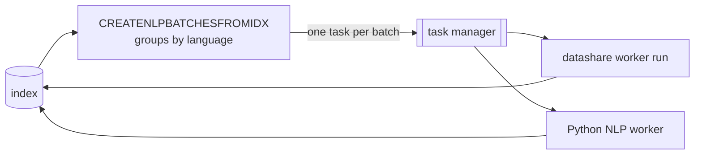

# CREATENLPBATCHESFROMIDX

An alternative to [NLP](nlp.md) for pipelines that process documents in batches rather than one at a time, such as the Python worker running spaCy.

The stage scrolls the index, groups documents by language, and submits **one task per batch**. Those tasks do the actual entity extraction, and they are executed by task workers rather than by this command.

```bash
datashare stage run \
  --stages CREATENLPBATCHESFROMIDX \
  --defaultProject my-project \
  --nlpPipeline SPACY \
  --batchSize 1024 \
  --maxTextLength 1024 \
  --elasticsearchAddress http://elasticsearch:9200 \
  --queueType REDIS \
  --redisAddress redis://redis:6379
```

## Input and output

| | |
| --- | --- |
| Reads | the Elasticsearch index named after `--defaultProject` |
| Writes | one `batch-ner` **task** per batch, submitted to the task manager |
| Distributable | **No.** It scrolls the index end to end. The tasks it creates are what get distributed |

## Options that affect it

| Option | Default | Effect |
| ------ | ------- | ------ |
| `--nlpPipeline` | `CORENLP` | The pipeline each batch task will run. Use `SPACY` for the Python worker. |
| `--batchSize` | `1024` | Documents per batch, and therefore per task. |
| `--maxTextLength` | `1024` | Maximum text length passed per document. |
| `--searchQuery` | none | Restricts the selection. Without it, the stage selects documents not yet processed by `--nlpPipeline`. |
| `--scrollSize` | `1000` | Documents per scroll page. |
| `--scroll` | `60000ms` | Elasticsearch scroll duration. |
| `-P, --defaultProject` | `local-datashare` | The index to read. |

## Why a worker is needed



The stage on the left finishes as soon as the arrow to the task manager is drawn. The entities appear only once the workers on the right have run.

## Execution details

* **Batches are tasks, not queue entries.** This is the important difference with [NLP](nlp.md). The stage submits work to the task manager and returns as soon as everything is submitted, so the command finishing does not mean the entity extraction is finished.
* **Something has to execute those tasks.** Run a task worker against the same infrastructure:

  ```bash
  datashare worker run --busType REDIS --redisAddress redis://redis:6379
  ```

  For the `SPACY` pipeline, the Python NLP worker is what consumes them.
* **Batches never mix languages.** Documents are grouped by language and a batch is closed whenever the language changes, so a worker initialises one model per batch instead of one per document. That is the whole point of the batched mode.
* **The default selection is "not yet processed by this pipeline"**, which makes reruns resumable. Passing `--searchQuery` replaces that filter entirely, so the query decides what is reprocessed.
* **It is mutually exclusive with `NLP`.** Listing both in `--stages` is rejected: the stages run in pipeline order, so `NLP` would already have marked every document this one looks for, and it would create no batch at all.

## Following the work

The stage's own log tells you how many documents were selected and how many batches were queued. After that, follow the **tasks**, not the command: in the interface, or via the task API. A batch that fails leaves its documents unmarked, so they are selected again by the next run of this stage.

## See also

* [BATCHNLP](batchnlp.md), the stage name under which those tasks conceptually run.
* [NLP](nlp.md), the one-document-at-a-time alternative used by CoreNLP and OpenNLP.
* [Scenario 7: extract named entities after indexing](../../server-mode/indexing/scenarios.md#scenario-7-extract-named-entities-after-indexing)
