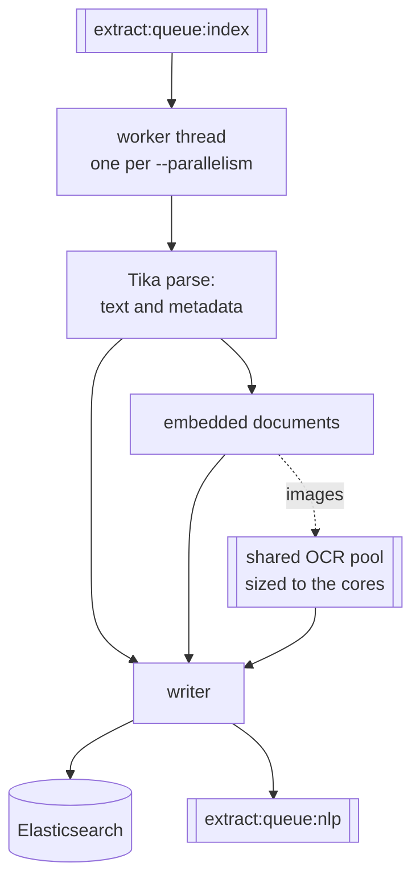

# INDEX

INDEX pops paths from its queue and, for each one, computes a content hash, extracts text and metadata with Apache Tika, OCRs images with Tesseract, descends into embedded documents, and writes the result to Elasticsearch.

```bash
datashare stage run \
  --stages INDEX \
  --dataDir /path/to/documents \
  --elasticsearchAddress http://elasticsearch:9200 \
  --reportName "report:my-project" \
  --queueType REDIS \
  --redisAddress redis://redis:6379
```

## Input and output

| | |
| --- | --- |
| Reads | `<queueName>:index`, and the files themselves from `--dataDir` |
| Writes | the Elasticsearch index named after `--defaultProject`, plus document ids to `<queueName>:<next stage>` |
| Distributable | **Yes.** The queue is a blocking list, so several machines pull different entries |

## Options that affect it

### Extraction

| Option | Default | Effect |
| ------ | ------- | ------ |
| `-o, --ocr` | `true` | Whether images are OCR'd at all. |
| `--ocrLanguage` | `eng` | Tesseract languages, `eng+fra` for several. They must be installed on the machine. |
| `--ocrStrategy` | `NO_OCR` | Whether PDF **pages** are rendered and OCR'd. `AUTO` for scanned PDFs. |
| `--ocrType` | `TESSERACT` | OCR engine. |
| `--ocrTimeout` | `12h` | Limit for a single OCR run. |
| `--parseTimeout` | `24h` | Limit for one document **and its whole embedded tree**. `0` disables it, with a warning. |
| `--maxEmbedDepth` | `20` | How deep to descend into nested containers. `0` disables the guard. |
| `--maxContentLength` | `20000000` | Text kept per document. Accepts `20M`. Longer text is truncated, the document is still indexed. |
| `-l, --language` | detected | Forces the language instead of detecting it from the extracted text. |
| `--charset` | JVM default | Encoding used for extracted text and metadata. |

### Identity

| Option | Default | Effect |
| ------ | ------- | ------ |
| `--digestAlgorithm` | `SHA384` | Hash used to build document ids. |
| `--digestProjectName` | none | Mixes the project name into the hash, so the same file in two projects gets two ids. |

### Throughput and bookkeeping

| Option | Default | Effect |
| ------ | ------- | ------ |
| `--parallelism` | number of cores | Documents extracted concurrently. |
| `--reportName` | none | Enables the report map. Without it nothing is recorded and nothing is skipped on a rerun. |
| `--indexTimeout` | `30` | Minutes between `Consumer has not terminated yet` log lines while waiting for in-flight documents. |
| `--createIndex` | none | Creates an index with the given name before running. |
| `--artifacts` / `--artifactDir` | none | Also write embedded payloads to disk as the parse goes. INDEX only produces the `raw` type. |

Extract carries further knobs, for the OCR pool, the mailbox fan-out, the embedded-text buffers and the streaming writer. **None of them is exposed as a flag, and a settings file does not reach a stage run**, so their defaults are what you get. They are described as behaviour in [Tuning](../../server-mode/indexing/tuning.md).

## How one document flows through



## Execution details

* **One document per worker thread.** `--parallelism` threads each take one path and own it until it is written, including its whole embedded tree. A container is therefore a single work unit: ten mailboxes use ten threads, one mailbox uses one.
* **OCR of embedded images does not stay on that thread.** Eligible images found inside a container are handed to a shared OCR pool sized to the core count, so attachments OCR in parallel even though the container is walked serially. Loose images on disk are OCR'd inline by the worker that picked them up.
* **Document ids are content hashes**, so indexing the same file twice updates one document instead of creating two. Changing `--digestAlgorithm` or `--digestProjectName` mid-project produces a second set of ids for the same files.
* **Embedded documents become documents.** A mailbox, an archive, or an email with attachments produces one indexed document per item, linked to its parent, which is why file counts and document counts differ by orders of magnitude.
* **The index is created if it does not exist**, with Datashare's mappings.
* **It writes to the next stage's queue as it goes.** Every document written to Elasticsearch is also pushed as an id onto `<queueName>:<next stage>`. When `--stages` ends at INDEX, "next" falls back to NLP, so `extract:queue:nlp` fills up even when you are not running NLP. With Redis that list stays until something consumes it.
* **Language is detected from the extracted text** unless `--language` is set. Setting it saves time and avoids pathological detection on files that are not prose.
* **Termination**: when SCAN is listed in the same command, INDEX keeps polling while SCAN runs. Alone, it stops on its first empty poll. It then waits for in-flight documents, logging every `--indexTimeout` minutes.

## The report map

`--reportName` is what makes a run resumable. With it, the outcome of every path is recorded, and on a later run:

* paths recorded as **success** are skipped;
* paths recorded as a **parse timeout** or a **fatal error** are also skipped, because retrying them would spend the same hours or crash the same way;
* every other failure (Elasticsearch briefly unavailable, an interrupted worker) is **retried**.

To force a retry of a terminal failure, use a fresh report name or delete its entry. The map lives wherever `--queueType` points, so pair it with `REDIS` to make it survive the process.

## Failure and restart

| Situation | What happens |
| --------- | ------------ |
| A file fails to parse | Recorded in the report map, the run continues |
| An embedded document fails | The embed is indexed with an error marker and no text, its parent is unaffected |
| OCR times out on a loose image | The file is not indexed, and it is retried on the next run |
| The parse exceeds `--parseTimeout` | Recorded as a **terminal** timeout, which later runs will **not** retry |
| The process is killed | Queued paths survive in Redis, completed paths are in the report map, the handful of documents in flight are in neither |
| A restart during a huge container | That file restarts from the beginning: the report map records whole files, not positions inside them |

## See also

* [Tuning and performance](../../server-mode/indexing/tuning.md) for parallelism, OCR threads and heap sizing.
* [Troubleshooting](../../server-mode/indexing/troubleshooting.md) for what the errors mean.
* [SCAN](scan.md) upstream, [NLP](nlp.md) and [ARTIFACT](artifact.md) downstream.
