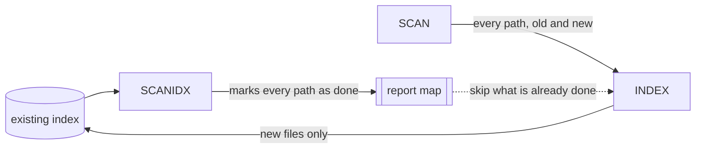

# SCANIDX

SCANIDX reads an existing Elasticsearch index and writes every document path it finds into a **report map**, marked as already done. Combined with the same `--reportName` on a later `SCAN,INDEX` run, it is what lets you add new files to a project without extracting the old ones again.

```bash
datashare stage run \
  --stages SCANIDX \
  --defaultProject my-project \
  --reportName "report:my-project" \
  --elasticsearchAddress http://elasticsearch:9200 \
  --queueType REDIS \
  --redisAddress redis://redis:6379
```

## Input and output

| | |
| --- | --- |
| Reads | the Elasticsearch index named after `--defaultProject` |
| Writes | the report map named by `--reportName`, or `extract:report` when unset |
| Distributable | **No.** It scrolls the whole index; a second copy duplicates the work |

## Options that affect it

| Option | Default | Effect |
| ------ | ------- | ------ |
| `-P, --defaultProject` | `local-datashare` | The index to read. |
| `--reportName` | `extract:report` | The report map to fill. Use the same value on the INDEX run that follows. |
| `--queueType` | `MEMORY` | Where the report map lives. Use `REDIS`, otherwise the map disappears with the process. |
| `--scrollSize` | `1000` | Documents per scroll page, and the write batch size. |
| `--scrollSlices` | `1` | Parallel slices of the scroll. Raise it on a large index. |
| `--scroll` | `60000ms` | Elasticsearch scroll duration. |

## How it makes a second run cheap



## Execution details

* **It records paths, not ids.** The report map is keyed by file path, which is what the INDEX stage checks before extracting.
* **Everything it finds is marked as a success**, unconditionally. SCANIDX does not verify that the indexed document is complete or up to date: it takes the presence of a path in the index as proof that the file has been processed.
* **A file changed on disk since it was indexed will therefore be skipped.** If you need it re-extracted, use a different report name, or remove that entry from the map.
* **Slices are processed in parallel** when `--scrollSlices` is above 1, which makes a large index much faster to import.
* **It writes in batches** the size of `--scrollSize`, one write per scroll page.

## Failure and restart

SCANIDX is idempotent: re-running it simply rewrites the same entries. If it is interrupted halfway, run it again before starting the INDEX stage, otherwise the paths it had not reached yet will be extracted a second time (which updates the same documents rather than duplicating them, so it costs time and nothing else).

## See also

* [Scenario 3: add new files without reprocessing the old ones](../../server-mode/indexing/scenarios.md#scenario-3-add-new-files-without-reprocessing-the-old-ones)
* [INDEX](index.md), which reads the report map this stage writes.
