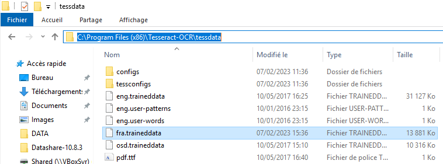
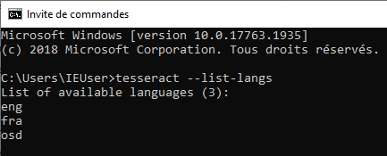

# Add more languages

To be able to perform OCR, Datashare uses an open source technology called **Apache Tesseract**. When Tesseract extracts text from images, it uses 'language packages' especially trained for each specific languages. Unfortunately, those packages can be heavy and to ensure a lightweight installation of Datashare, the installer doesn't use them all by default. In the case Datashare informs you of a missing package, this guide explains you how to manually install it on your system.

### Install packages on Linux

To add OCR languages on Linux, simply use the following command:

```
sudo apt install tesseract-ocr-[lang]
```

Where \`\[lang]\` is can be : &#x20;

* `all`  if you want to install all languages
* a language code (ex: `fra`, for French), the list of languages is available [here](https://tesseract-ocr.github.io/tessdoc/Data-Files-in-different-versions.html)

### Install packages on Mac

The Datashare Installer for Mac checks for the existence of either [MacPorts](https://ports.macports.org/) or [Homebrew](https://brew.sh/), which package managers are used for the installation of Tesseract. If none of those two package managers is present, the Datashare Installer will install **MacPorts by default**.

#### With MacPorts (default)

First, you must check that MacPort is installed on your computer. Please run in a Terminal:

```
port version
```

You should see an output similar to this:

<figure><figcaption></figcaption></figure>

If you get a `command not found: port`, this either means you are using Homebrew (see next section) or you did not [run the Datashare installer for Mac](install-datashare-on-mac/) yet.

If MacPort is installed on your computer, you should be able to add the missing Tesseract language package with the following command (for German):

```
port install tesseract-deu
```

The full list of supported language packages can be found [on MacPorts website](https://ports.macports.org/search/?installed_file=\&q=tesseract-\&name=on).

Once the installation is done, close and restart Datashare to be able to use the newly installed packages.

#### With Homebrew

If Homebrew was already present on your system when Datashare was installed, Datashare used it to install Tesseract and its language packages. Because Homebrew doesn't package each Tesseract language individually, **all languages** are already supported by your system. In other words, **you have nothing to do**!

If you want to check if Homebrew is installed, run the following command in a Terminal:

```
brew -v
```

You should see an output similar to this:

<figure><figcaption></figcaption></figure>

If you get a `command not found: brew` error, this mean Homebrew is not installed on your system. You might either use MacPorts (see previous section) or [run the Datashare installer for Mac](install-datashare-on-mac/) on your computer.

### Install languages on Windows

Languages packages are available on Tesseract [Github repository](https://github.com/tesseract-ocr/tessdata). Trained data files have to be downloaded and added into `tessdata` folder in Tesseract's installation folder.

\*Additional languages can be also added during Tesseract's installation.

<figure><figcaption><p>Download and add French into tessdata</p></figcaption></figure>

The list of installed languages can be checked with Windows command prompt or Powershell with the command `tesseract --list-langs.`

<div align="center"><figure><figcaption><p>French is listed in installed languages</p></figcaption></figure></div>

Datashare has to be restarted after the language installation. Check how for [Mac](install-datashare-on-mac/open-datashare-on-mac.md), [Windows](install-datashare-on-windows/open-datashare-on-windows.md) and [Linux](install-datashare-on-linux/open-datashare-on-linux.md).
