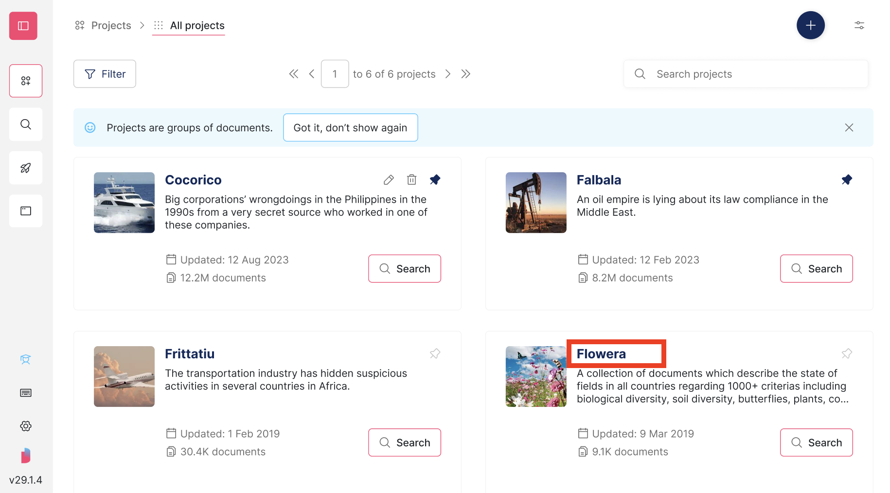
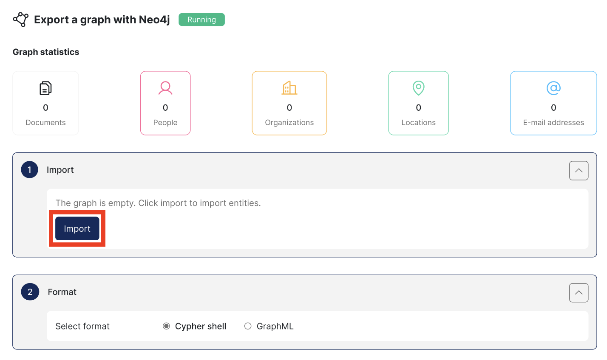
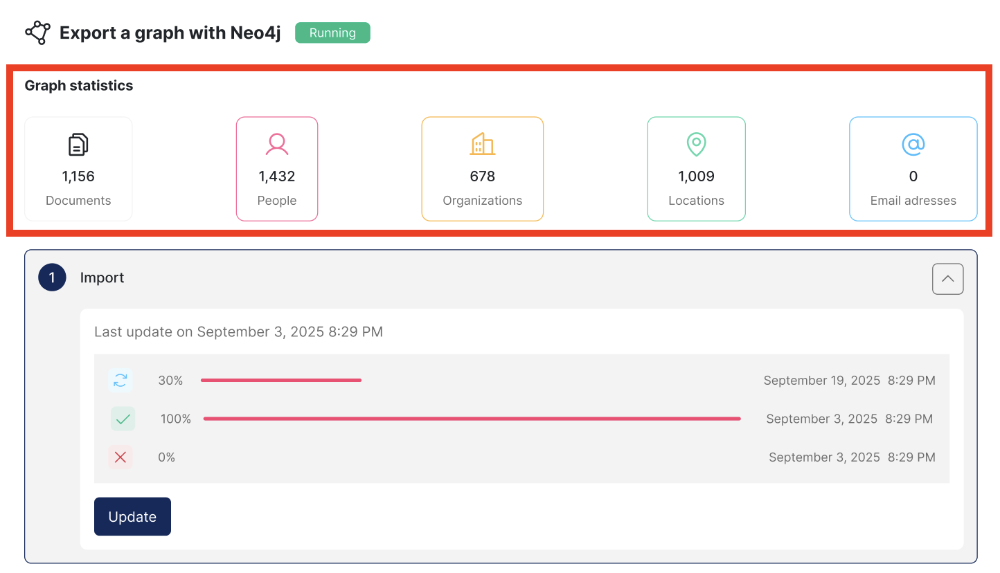
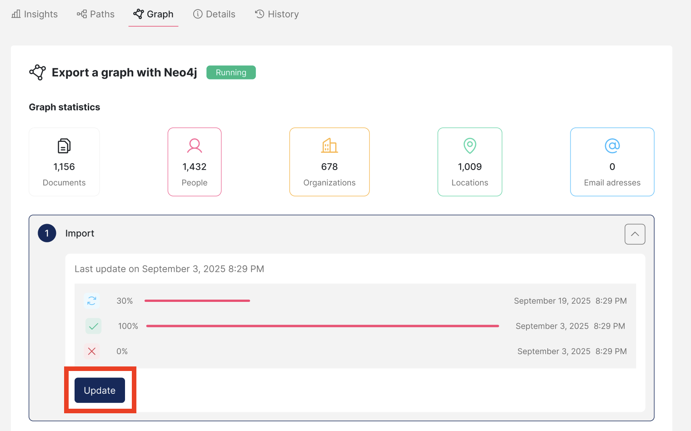
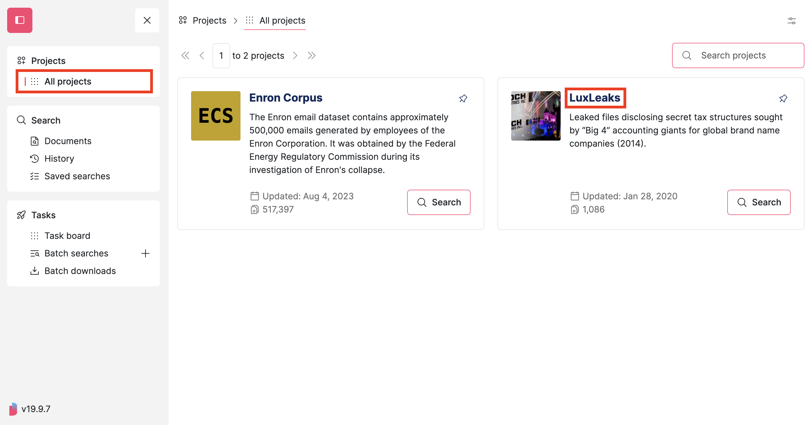
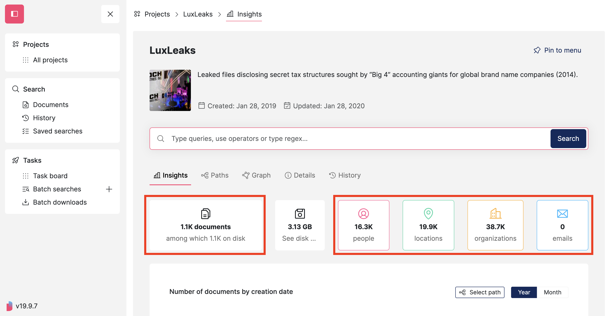
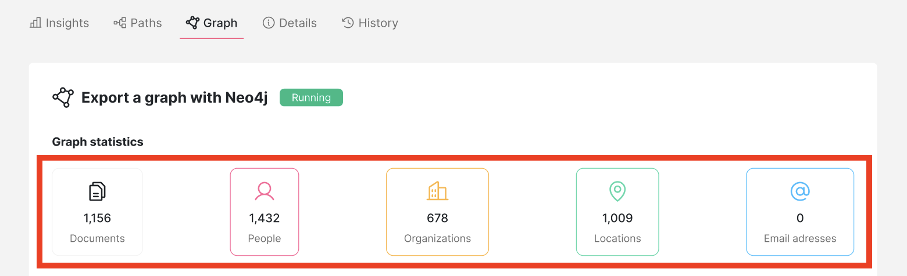

# Create and update Neo4j graph

## Create the graph

1. Go to '**All projects'** and click on your **project's name**:

<figure><figcaption></figcaption></figure>

2. Go to the **Graph tab** and in the first step '**Import**', click on the '**Import'** button:

<figure><figcaption></figcaption></figure>

You will then see a **new import task running**.

When the graph creation is complete, '**Graph statistics'** will reflect the number of documents and entities nodes found in the graph:

<figure><figcaption></figcaption></figure>

## Update the graph

If new documents or entities are added or modified in Datashare, you will need to update the Neo4j graph to reflect these changes.

Go to '**All projects**' > one **project's page** > the '**Graph**' tab. In the first step, click on the '**Update graph'** button:

<figure><figcaption></figcaption></figure>

To detect whether a graph update is needed, go to the '**Projects'** page and open your project:

<figure><figcaption>
Open your project
</figcaption></figure>

Compare the number of documents and entities found in Datashare in '**Projects**' > '**Your project**' > '**Insights**'...

<figure><figcaption>
Statistics of one project
</figcaption></figure>

...with the numbers found in your project in the '**Graph' tab**. Run an update in case of mismatch:

<figure><figcaption></figcaption></figure>

The update will **always add missing nodes and relationships, update existing ones if they were modified, but will never delete graph nodes or relationships**.

You can now [explore your graph](../../usage/explore-the-neo4j-graph.md#exploring-your-graph) using your favorite visualization tool.
