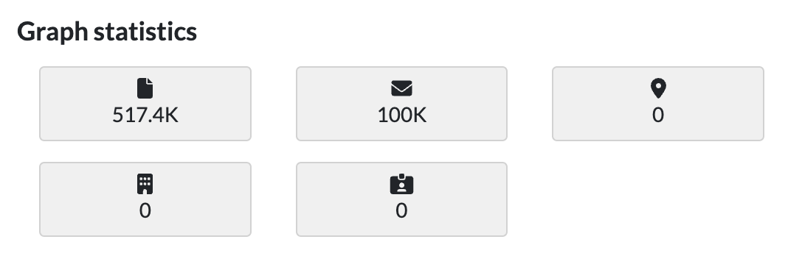

# Create and update your graph 

## Create the graph

1. Open the '**Projects'** page and select your project:

2. Create the graph by clicking on the '**Create graph'** button inside the neo4j widget: 

You will see a new import task running:

When the graph creation is complete, '**Graph statistics'** will reflect the number of documents and entities nodes found in the graph:

## Update the graph

When new documents or entities are added or modified inside Datashare, you will need to update the neo4j graph to reflect these changes.

To update the graph click on the '**Update graph'** button inside the neo4j widget:

To detect whether a graph update is needed you can compare the number of documents found inside Datashare to the number found in the '**Graph statistics'** and run an update in case of mismatch:

The update will **always add missing nodes and relationships, update existing ones if they were modified, but will never delete graph nodes or relationships**.

## Next steps 
- [explore your graph](../../usage/explore-the-neo4j-graph.md#exploring-your-graph) using your favorite visualization tool
