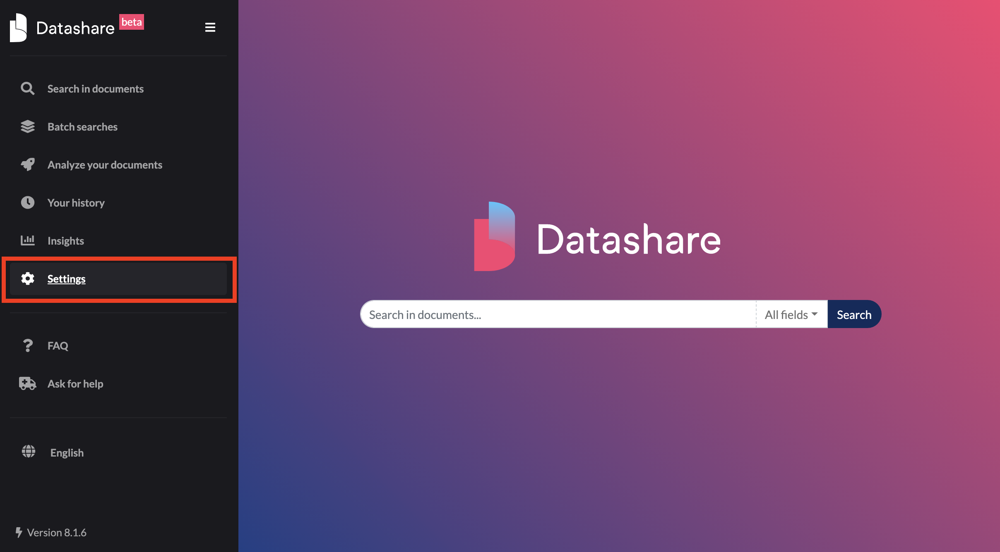
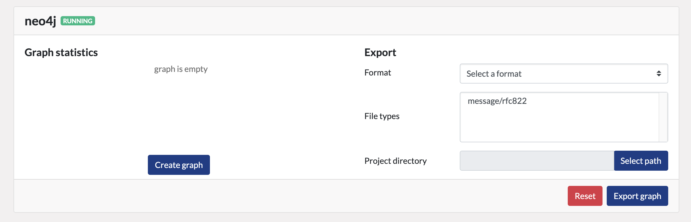

# Run Datashare with the neo4j plugin

## Install the neo4j plugin

Install the neo4j plugin following instructions available in the [dedicated page](../plugins-and-extensions.md).

## Configure the neo4j plugin

1. Go to "**Settings**":

2. Make sure the following settings are properly set:
- `Neo4j Host` should be `localhost` or the address where your neo4j instance is running
- `Neo4j Port` should be the port where your neo4j instance is running (`7687` by default)
- `Neo4j User` should be set to your neo4j user name (`neo4j` by default)
- `Neo4j Password` **should only be set if your neo4j user is using password authentication** 

3. **When running `Neo4j Community Edition`, set the `Neo4j Single Project` value**. 
In community edition the neo4j DBMS is restricted to a single database.
Since Datashare supports multiple projects, you must set the `Neo4j Single Project` with the name of the project which will use neo4j plugin.
**Other projects won't be able to use the neo4j plugin**.

4. Restart Datashare to apply the changes

5. You should be able to see the neo4j widget in your project page, after a small while its status should be `RUNNING`:

## Next step

**You can now [create the graph](create-and-update-the-graph.md) !**
