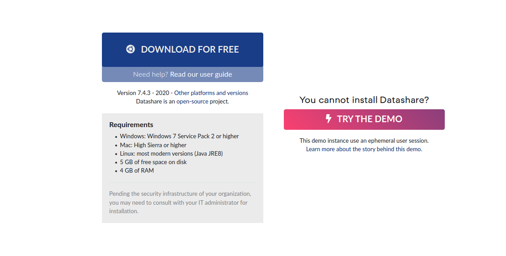

# Install on Linux

Currently, only a .deb package for Debian/Ubuntu is provided.

If you want to run it with another Linux distribution, you can download the latest version of the Datashare jar here : [https://github.com/ICIJ/datashare/releases/latest](https://github.com/ICIJ/datashare/releases/latest)

And adapt the following launch script : [https://github.com/ICIJ/datashare/blob/master/datashare-dist/src/main/deb/bin/datashare](https://github.com/ICIJ/datashare/blob/master/datashare-dist/src/main/deb/bin/datashare) to your environment.

### 1.  Download Datashare

Go to [datashare.icij.org](https://datashare.icij.org), scroll down and click '**Download .deb'**



Save the Debian package as a file


### 2. Install the package

```
$ sudo apt install /dir/to/debian/package/datashare-dist_7.2.0_all.deb
```

### 3. Run Datashare with:

```
$ datashare
```

You can now [**start Datashare**](open-datashare-on-linux.md)!
