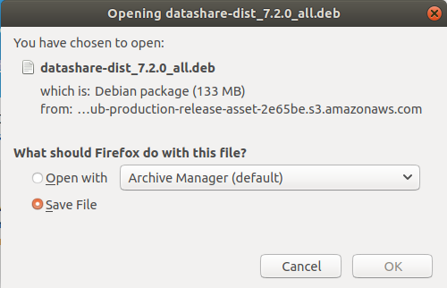

# Install Datashare

Currently, only a .deb package for Debian/Ubuntu is provided.

If you want to run it with another Linux distribution, you can download the latest version of the Datashare jar here: [https://github.com/ICIJ/datashare/releases/latest](https://github.com/ICIJ/datashare/releases/latest)

And adapt the following launch script to your environment: [https://github.com/ICIJ/datashare/blob/master/datashare-dist/src/main/deb/bin/datashare](https://github.com/ICIJ/datashare/blob/master/datashare-dist/src/main/deb/bin/datashare).



#### Download Datashare

Go to [datashare.icij.org](https://datashare.icij.org) and click '**Download for Linux**':

<figure><figcaption></figcaption></figure>

Save the **Debian package** as a file:

<figure><figcaption><p>Save as file</p></figcaption></figure>



#### Install the package

```
$ sudo apt install /dir/to/debian/package/datashare-dist_7.2.0_all.deb
```



#### Run Datashare

```
$ datashare
```



You can now [start Datashare](open-datashare-on-linux.md).
