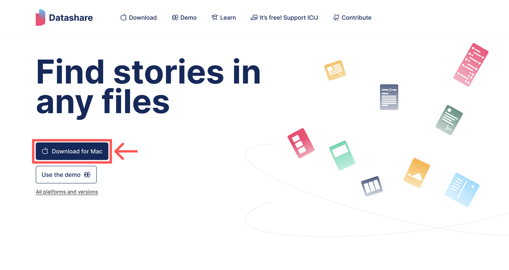

# Install Datashare

The installer will take care of checking that your system have all the dependencies to run Datashare. Because this software use [Apache Tesseract](https://github.com/tesseract-ocr/tesseract) (to perform Optical Character Recognition, OCR) and Mac doesn't support them out-of-box, heavy dependencies must be downloaded. If your system have none of those dependencies, the first installation of Datashare can take up to 30 minutes.

The installer will set up:

* **Xcode Command Line Tools** (if neither XCode or [Xcode Command Line Tools](https://mac.install.guide/commandlinetools/index.html) are installed)
* **MacPorts** (if neither Homebrew or MacPorts are installed)
* **Apache Tesseract** with MacPorts or Homebrew
* **Java JRE 17**
* **Datashare** executable

**Note:** Previous versions of this document referred to a "Docker Installer". We do not provide this installer anymore but Datashare is still [published on the Docker Hub](https://hub.docker.com/r/icij/datashare) and supported with Docker.

**Installation fails:** &#x20;

* Fail to install MacPorts: you can manually install [Homebrew](https://brew.sh/) first and then restart the installer.&#x20;
* "System Software from application was blocked from loading" : Check in your Mac's "System Settings" > "privacy & security" if you have a section with this mention "System software from application 'Datashare' was blocked from loading" or something similar related to Datashare. If you have this section you'll have to click "Allow" to be able to install datashare.
* For any other issue check our [Github issues](https://github.com/ICIJ/datashare/issues) or [create a new one](https://github.com/ICIJ/datashare/issues/new?template=bug_report.md) with your setup (macOs version) and installer logs (Command+L when the installer is launched and failed).



### **Download Datashare**

Go to [datashare.icij.org](https://datashare.icij.org) and click '**Download for Mac'**.

<figure><figcaption>
<a href="https://datashare.icij.org">datashare.icij.org</a>
</figcaption></figure>



### Start the installer

In Finder, go to your '**Downloads'** directory and double-click '**datashare-X.Y.Z.pkg'**:

<figure><figcaption></figcaption></figure>



### **Go through the Datashare Installer**

Click '**Continue**', '**Install**', enter your password and '**Install Software**':

<figure><figcaption></figcaption></figure>

<figure><figcaption></figcaption></figure>

<figure><figcaption></figcaption></figure>

The installation begins. You see a progress bar. It stays a long time on "Running package scripts" because it is installing XCode Command Line Tools, MacPort, Tesseract OCR, Java Runtime Environment and finally Datashare.

You can see what it actually does by typing command+L: it will open a window which logs every action made.

In the end, you should see this screen:

<figure><figcaption></figcaption></figure>

You can now safely close this window.



You can now [start Datashare](open-datashare-on-mac.md).
