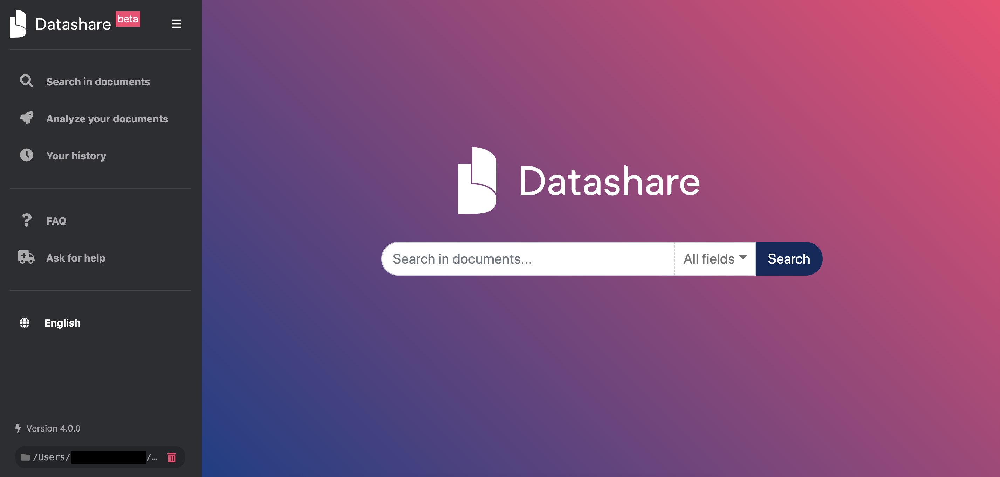

# Start Datashare

Once Datashare is installed, go to "**Finder"**, then "**Applications"**, and double-click on "**Datashare**".

<figure><figcaption></figcaption></figure>

A Terminal window called '**Datashare.command'** opens and describes the technical operations going on during the opening.

<figure><figcaption></figcaption></figure>

**Keep this Terminal window open as long as you use Datashare.**

**Datashare should now automatically open in your default internet browser.**\
If it doesn’t, type "[localhost:8080](http://localhost:8080)" in your browser. Datashare **must be accessed from your internet browser** (Firefox, Chome, etc), even though it works offline without Internet connection (see FAQ: [Can I use Datashare with no internet connection?](https://icij.gitbook.io/datashare/faq-general/can-i-use-datashare-with-no-internet-connection)).

You can now [add documents to Datashare](add-documents-to-datashare-on-mac.md).
