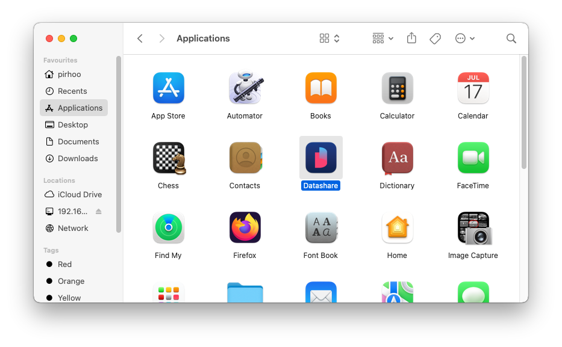
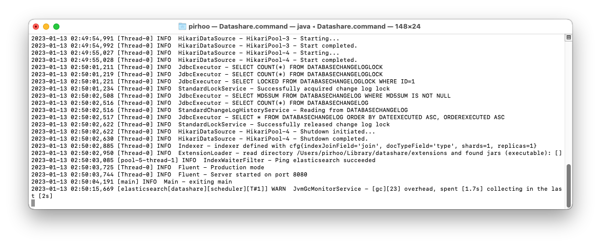

# Start Datashare

Once Datashare is [installed](./), go to '**Finder**' > '**Applications**', and double-click on '**Datashare**':

<figure><figcaption></figcaption></figure>

A Terminal window called '**Datashare.command**' opens and describes the technical operations going on during the opening:

<figure><figcaption></figcaption></figure>

**⇒ Important: Keep this Terminal window open as long as you use Datashare.**

Once the process is done, **Datashare should now automatically open in your default internet browser.** If it doesn’t, type '[localhost:8080](http://localhost:8080)' as a URL in your browser.&#x20;

Datashare **must be accessed from your internet browser** (Firefox, Chome, etc), even though it works offline without Internet connection (see FAQ: [Can I use Datashare with no internet connection?](../../usage/faq/general/can-i-use-datashare-with-no-internet-connection.md)).

<figure><figcaption>
Datashare's homepage
</figcaption></figure>

You can now [add documents to Datashare](add-documents-to-datashare-on-mac.md).
