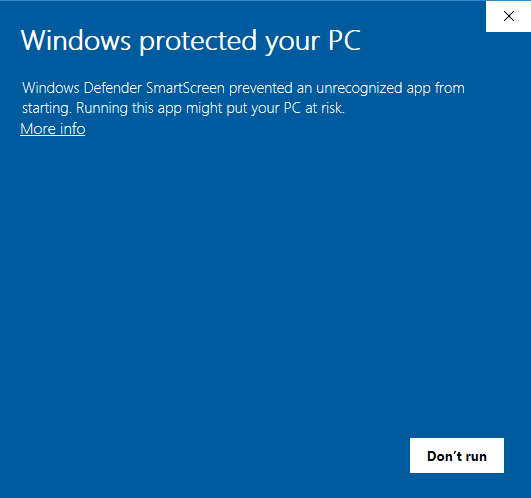
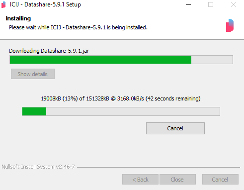

# Install Datashare



### Uninstall any prior standard version

Before we start, please **uninstall any prior standard version of Datashare** if you had already installed it. You can follow these steps: [https://www.laptopmag.com/articles/uninstall-programs-windows-10](https://www.laptopmag.com/articles/uninstall-programs-windows-10)



### Download Datashare

Go to [datashare.icij.org](https://datashare.icij.org) and click '**Download for Windows**':

<figure><figcaption>
<a href="https://datashare.icij.org">datashare.icij.org</a>
</figcaption></figure>

The file '**datashare-X.Y.Z.exe**' is now downloaded. You can find it in your **Downloads**.&#x20;

**Double-click** on the name of the file in order to execute it.



### Allow Datashare

As Datashare is not signed, this popup asks for your permission. Don't click 'Don't run' but **click** '**More info'**:

<figure><figcaption></figcaption></figure>

Click '**Run anyway**':

<figure><figcaption></figcaption></figure>

It asks if you want to allow the app to make changes to your device. Click '**Yes**':

<figure><figcaption></figcaption></figure>



### Install Datashare

On the Installer Wizard, as you need to download and install OpenJDK11 if it is not installed on your device, click '**Install**':

<figure><figcaption></figcaption></figure>

The following windows with progress bars will be displayed:

<figure><figcaption></figcaption></figure>

<figure><figcaption></figcaption></figure>

<figure><figcaption></figcaption></figure>

Choose a language and click '**OK**':

<figure><figcaption></figcaption></figure>



### Install Tesseract OCR

To install **Tesseract OCR**, click the following buttons on the Installer Wizard's windows:

<figure><figcaption></figcaption></figure>

<figure><figcaption></figcaption></figure>

<figure><figcaption></figcaption></figure>

<figure><figcaption></figcaption></figure>

<figure><figcaption></figcaption></figure>

<figure><figcaption></figcaption></figure>

<figure><figcaption></figcaption></figure>

Untick '**Show README**' and click '**Finish**':

<figure><figcaption></figcaption></figure>

Finally, click '**Close**' to close the installer of TesseractOCR.



### Install Datashare.jar

It is now downloading the back-end and the front-end, Datashare.jar:

<figure><figcaption></figcaption></figure>

When it is finished, click '**Close**':

<figure><figcaption></figcaption></figure>



You can now [start Datashare](open-datashare-on-windows.md).
