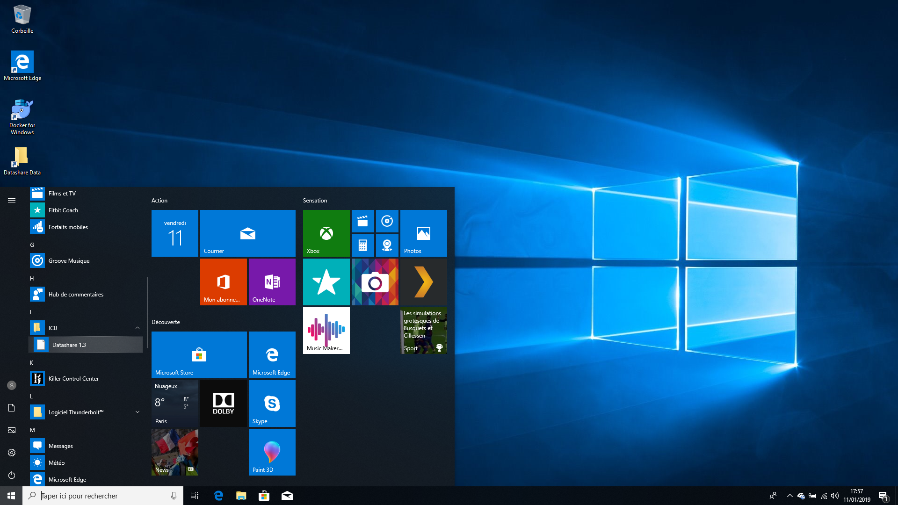
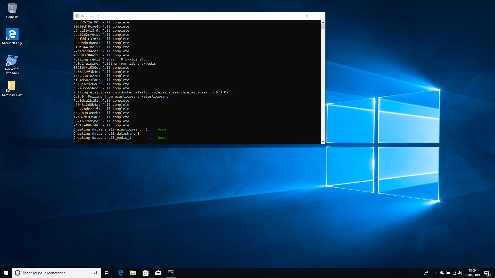

# Start Datashare

Open the Windows main menu at the left of the bar at the bottom of your computer screen and click on '**Datashare'**. (The numbers after 'Datashare' just indicate which version of Datashare you installed.)

<figure> &#x27;Datashare 1.3&#x27; highlighted"><figcaption></figcaption></figure>

A window called 'Terminal' will have opened, showing the progress of opening Datashare. **Do not close this black window as long as you use Datashare**.

<figure><figcaption></figcaption></figure>

**Keep this Terminal window open as long as you use Datashare.**

**Datashare should now automatically open in your default internet browser.**\
If it doesn’t, type '[localhost:8080](http://localhost:8080)' in your browser.&#x20;

Datashare **must be accessed from your internet browser** (Firefox, Chome, etc), even though it works offline without Internet connection (see FAQ: [Can I use Datashare with no internet connection?](../../usage/faq/general/can-i-use-datashare-with-no-internet-connection.md)).

<figure><figcaption>
Datashare's homepage
</figcaption></figure>

You can now [add documents to Datashare](add-documents-to-datashare-on-windows.md).
