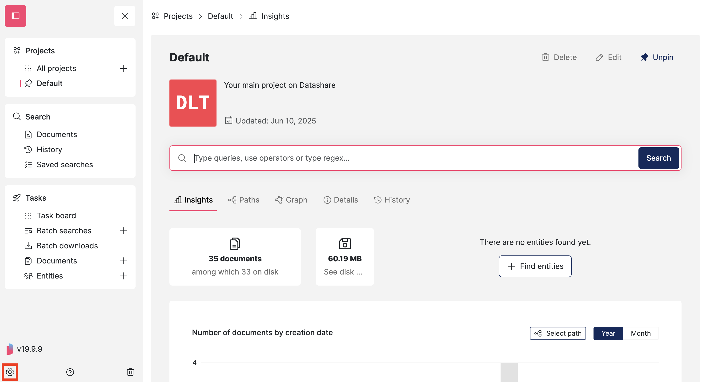
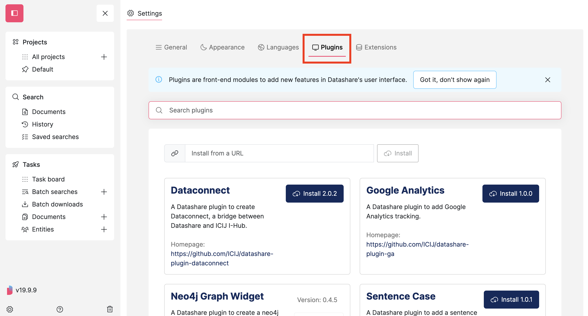
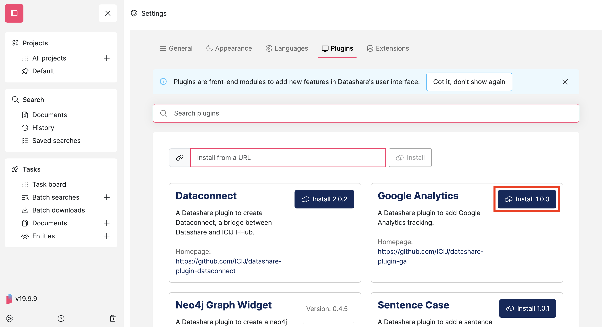
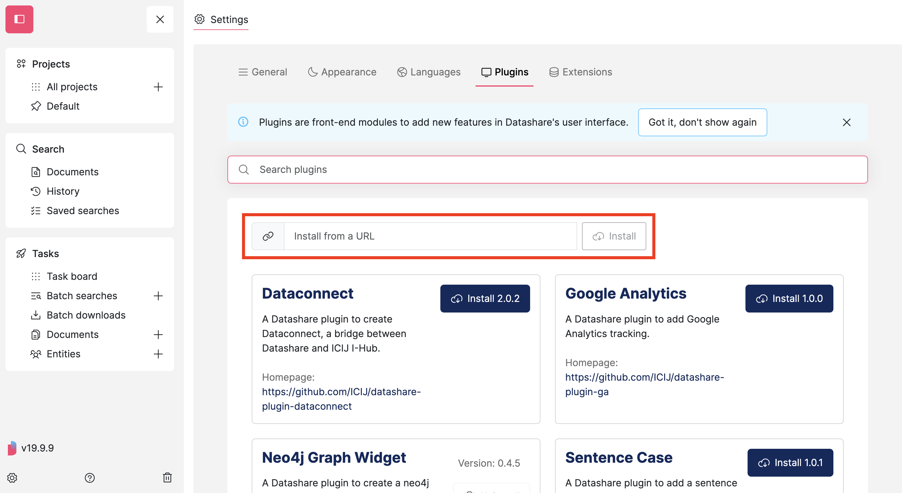
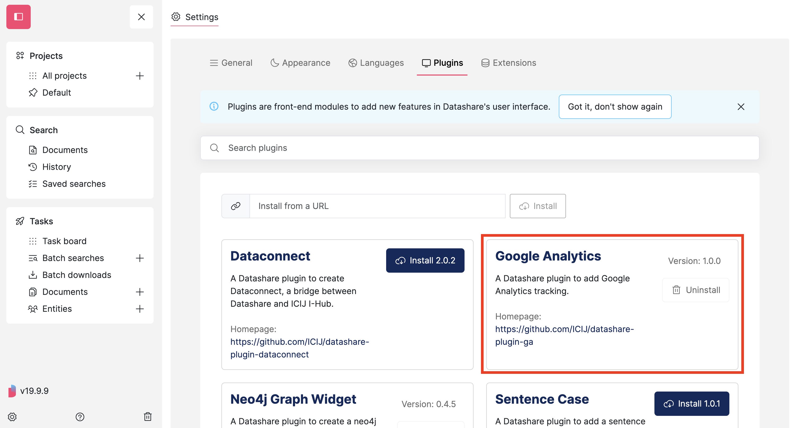
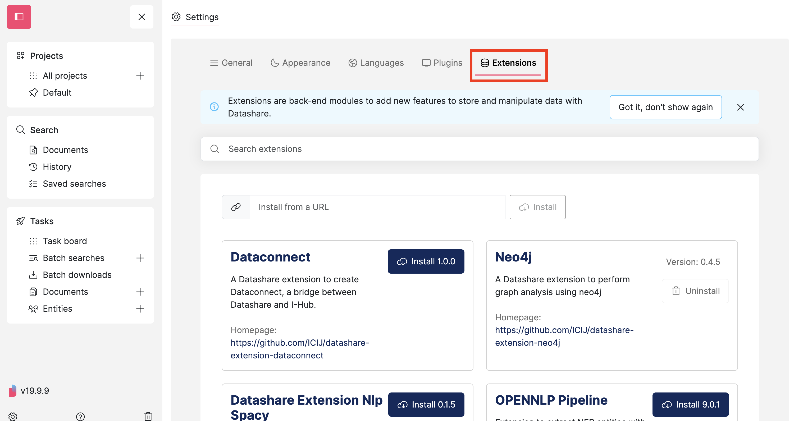
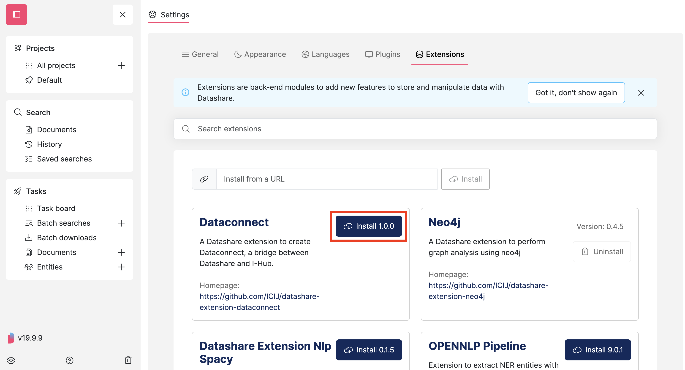
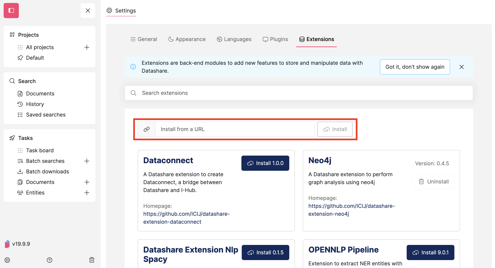
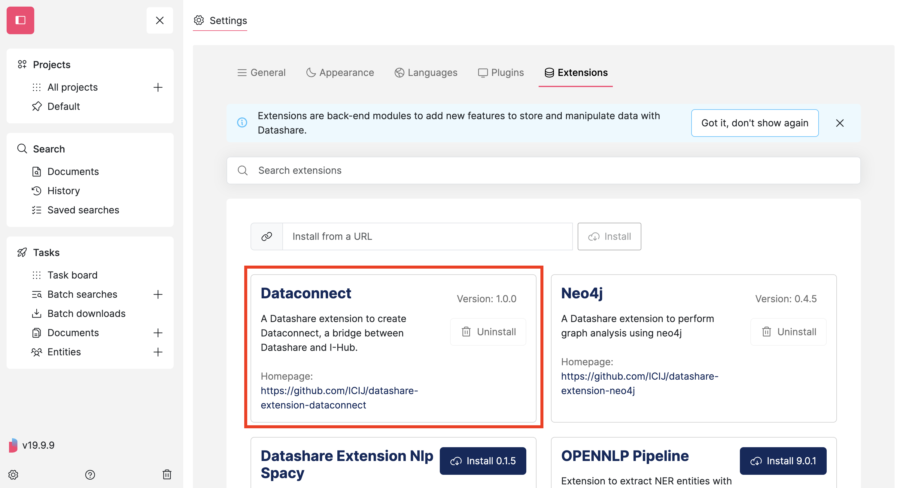

# Install plugins and extensions

**Plugins** are **front-end** modules to add new features in Datashare's user interface.

**Extensions** are back-end modules to add new features to store and manipulate data with Datashare.

## Add plugins to Datashare's front-end



At the bottom of the menu, click the '**Settings' icon**:

<figure><figcaption></figcaption></figure>



Open the '**Plugins'** tab:

<figure><figcaption></figcaption></figure>



Choose the plugin you want to add and click '**Install'**:

<figure><figcaption></figcaption></figure>

If you want to install a plugin from an URL, click '**Install from a URL**':

<figure><figcaption></figcaption></figure>



Your plugin is now installed:

<figure><figcaption></figcaption></figure>



**Refresh your page** to see your new plugin activated in Datashare.



## Add **extensions** to Datashare's back-end



At the bottom of the menu, click the '**Settings' icon**:

<figure><figcaption></figcaption></figure>



Open the '**Extensions'** tab:

<figure><figcaption></figcaption></figure>



Choose the extension you want to add and click '**Install'**:

<figure><figcaption></figcaption></figure>

If you want to install an extension from an URL, click '**Install from a URL**':

<figure><figcaption></figcaption></figure>



Your extension is now installed:

<figure><figcaption></figcaption></figure>



**Restart Datashare** to see your new extension activated in Datashare. Check how for [Mac](install-datashare-on-mac/open-datashare-on-mac.md), [Windows](install-datashare-on-windows/open-datashare-on-windows.md) and [Linux](install-datashare-on-linux/open-datashare-on-linux.md).



## Update plugin or extension with latest version

When a newer version of a plugin or extension is available, get the latest version.

If it is a plugin, **refresh** your page to activate the latest version.

If it is an extension, **restart** Datashare to activate the latest version. Check how for [Mac](install-datashare-on-mac/open-datashare-on-mac.md), [Windows](install-datashare-on-windows/open-datashare-on-windows.md) and [Linux](install-datashare-on-linux/open-datashare-on-linux.md).

## Create your own plugin or extension

People who can code can create their own plugins and extensions by following these steps:

* [**Plugins**](../developers/frontend/write-plugins.md)
* [**Extensions**](../developers/backend/write-extensions.md)
