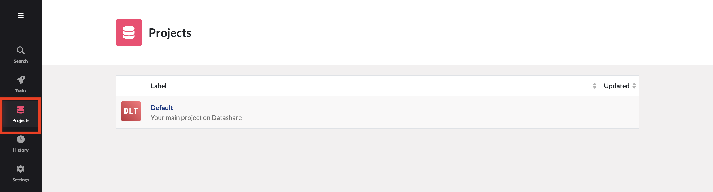
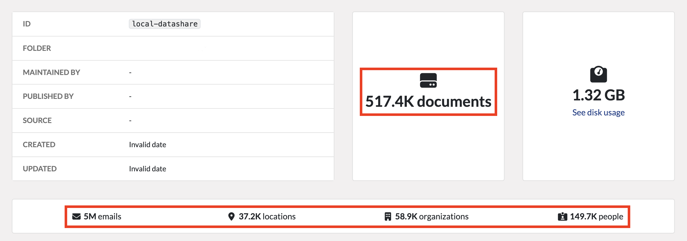
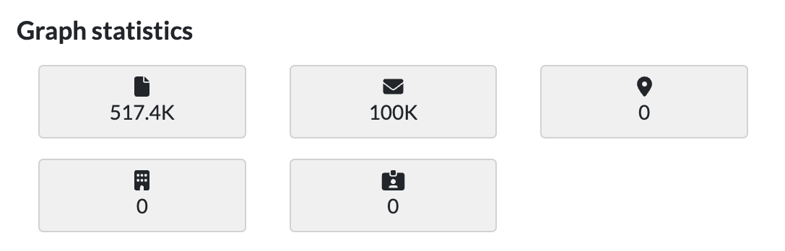

# Create and update the graph using Datashare CLI 

## Run the neo4j extension CLI

The neo4j related features are added to the DatashareCLI through the extension mechanism.
In order to run the extended CLI, the Java `CLASSPATH` must be extended with the path of the `datashare-extension-neo4j` jar.
By default, this jar is located in `/home/datashare/extensions`, so the CLI will be run as following:

```bash
docker compose exec \
  -e CLASSPATH=/home/datashare/extensions/datashare-extension-*.jar \
  datashare_web /entrypoint.sh \
  --mode CLI \
  --ext neo4j \
  ... 
```


## Create the graph

In order to create the graph, run the `--fullImport` command for your project:  
```bash
docker compose exec \
  -e CLASSPATH=/home/datashare/extensions/datashare-extension-*.jar \
  datashare_web /entrypoint.sh \
  --ext neo4j \
  --full-import \
  --project my-datashare-project-using-neo4j
```
the CLI will display the import task progress and log import related information.

## Update the graph

When new documents or entities are added or modified inside Datashare, you will need to update the neo4j graph to reflect these changes.

To update the graph, you can just re-run the full export:
```bash
docker compose exec \
  -e CLASSPATH=/home/datashare/extensions/datashare-extension-*.jar \
  datashare_web /entrypoint.sh \
  --ext neo4j \
  --full-import \
  --project my-datashare-project-using-neo4j
```

The update will **always add missing nodes and relationships, update existing ones if they were modified, but will never delete graph nodes or relationships**.

To detect whether a graph update is needed, open the '**Projects'** page and select your project:

compare the number of documents found inside Datashare:

 to the number found in the '**Graph statistics'** and run an update in case of mismatch:



## Next steps 
- [explore your graph](../../usage/explore-the-neo4j-graph.md#exploring-your-graph) using your favorite visualization tool
