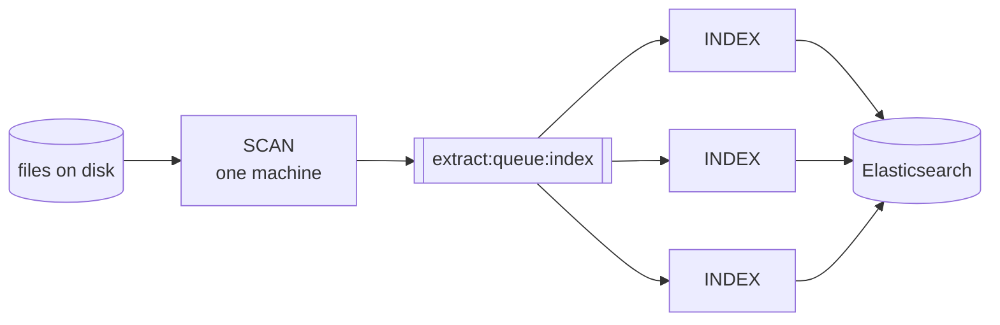

# Indexing

In server [mode](../../concepts/running-modes.md), Datashare has no web interface to add documents. Everything goes through the command line, which is a good thing: indexing is the most expensive operation Datashare performs, and the command line is where you get to control how much of your machine it uses, what it skips, and what it retries.

This section is for people who run Datashare on a server. It assumes you are comfortable with a terminal, Docker and system administration, but not that you read Java.

* [Indexing scenarios](scenarios.md): copy-paste recipes for the situations you will actually meet.
* [Indexing options](options.md): every option that matters, where to set it, and what it defaults to.
* [Tuning and performance](tuning.md): how to make indexing fast without losing documents.
* [Troubleshooting](troubleshooting.md): what the errors in your logs mean and what to do about them.

## What indexing actually does

For every file it finds, Datashare:

1. **Reads the bytes** and computes a hash. That hash is the document id, so indexing the same file twice produces the same document rather than a duplicate.
2. **Extracts text and metadata** with [Apache Tika](https://tika.apache.org/), which dispatches to a format-specific parser (PDFBox for PDF, POI for Office, java-libpst for Outlook mailboxes, and so on).
3. **Runs OCR** with [Tesseract](https://tesseract-ocr.github.io/) on images, if OCR is enabled.
4. **Descends into containers.** A ZIP, a PST mailbox, an email with attachments or a Word file with an embedded spreadsheet produce one indexed document per embedded item, linked to their parent. This is why 100 files on disk routinely become 100,000 documents in the index.
5. **Writes the document to Elasticsearch**, with its text, its metadata, its detected language and its position in the parent/child tree.

Named entity extraction (people, organizations, locations, email addresses) is a **separate stage** that runs over documents already in the index. You can run it later, or never.

## The pipeline model

Indexing is not one program, it is a chain of stages connected by queues:

Each stage is a consumer of one queue and a producer of the next. Two consequences drive everything else in this section:

* **A stage that reads from a queue can be run on several machines at once.** They pull from the same shared queue, so work is split between them. This is how you index a large corpus faster: add machines running the `INDEX` stage.
* **A stage can be run separately, later, or by itself.** You can scan today, inspect the queue, and index tomorrow.

Both require a **shared** queue, which means Redis (`--queueType REDIS`). With the default in-memory queue, the stages you list in a single command talk to each other inside one process and nothing survives that process.

## The stages

| Stage | What it does | Reads from | Distributable |
| ----- | ------------ | ---------- | ------------- |
| [`SCAN`](../../concepts/cli-stages/scan.md) | Walks `--dataDir` and pushes every file path onto the queue | filesystem | No, run it once |
| [`SCANIDX`](../../concepts/cli-stages/scanidx.md) | Reads the paths already present in an index and writes them into a report map, so a later run skips them | Elasticsearch | No |
| [`DEDUPLICATE`](../../concepts/cli-stages/deduplicate.md) | Drops paths already seen in the queue | queue | No |
| [`INDEX`](../../concepts/cli-stages/index.md) | Extracts text, OCR, metadata and embedded documents, then writes to Elasticsearch | queue | **Yes** |
| [`ENQUEUEIDX`](../../concepts/cli-stages/enqueueidx.md) | Pushes document ids from an existing index back onto a queue, optionally filtered by a search query | Elasticsearch | No |
| [`CATEGORIZE`](../../concepts/cli-stages/categorize.md) | Fills the `contentTypeCategory` field of already-indexed documents | queue | Yes |
| [`NLP`](../../concepts/cli-stages/nlp.md) | Runs named entity recognition on indexed documents | queue | **Yes** |
| [`ARTIFACT`](../../concepts/cli-stages/artifact.md) | Caches embedded document payloads on disk for preview and download | queue | Yes |
| [`CREATENLPBATCHESFROMIDX`](../../concepts/cli-stages/createnlpbatchesfromidx.md) | Groups indexed documents into batches and submits one NER task per batch, for batch-capable pipelines such as the Python worker | Elasticsearch | Yes |
| [`BATCHNLP`](../../concepts/cli-stages/batchnlp.md) | Listed in the stage enum but has no command-line implementation. The batch work is done by the tasks the stage above submits | n/a | n/a |

Stages always run in that order, whatever order you list them in. `SCAN`, `INDEX` and `NLP` are the three you will use most, and [CLI stages](../../concepts/cli-stages/README.md) has a runnable example for every one of them.

`NLP` and `CREATENLPBATCHESFROMIDX` are alternatives, not a sequence: asking for both in the same `--stages` is rejected with an error.

## Where the state lives

When something goes wrong, it helps to know which of these four places holds what:

| Where | What it holds | Survives a restart |
| ----- | ------------- | ------------------ |
| **Redis queue** (`extract:queue:index`) | Paths waiting to be indexed | Yes, with `--queueType REDIS` |
| **Report map** (`--reportName`) | Per-path outcome of the INDEX stage: success, failure and why | Yes, with `--queueType REDIS` |
| **Elasticsearch index** | The documents themselves | Yes |
| **Database** | Tasks, users, projects, batch searches | Yes |

A document popped from the queue but not yet finished when you stop the process is in none of them. It is neither queued nor recorded, so it will not be picked up again on the next run. On a large corpus that is a handful of documents, but if exactness matters, run a reconciliation pass at the end (see [scenarios](scenarios.md#find-what-is-missing)).

## Five things worth knowing before your first big run

1. **OCR is the single biggest cost.** It is on by default. On a corpus of scanned documents it can multiply the indexing time by 10 or more. Decide deliberately, do not inherit the default. See [Tuning](tuning.md#ocr).
2. **Set `--reportName`.** Without it, Datashare keeps no record of which files succeeded, and a restart re-extracts everything from the beginning. It costs nothing and it is the difference between a resumable run and a run you have to babysit.
3. **Try it on a subset first.** Point `--dataDir` at one directory, index it, look at the result in the interface, count the documents. Then run the whole corpus. A wrong OCR setting discovered after three days is expensive.
4. **One mailbox is one work unit.** A 40 GB PST file is a single queue entry. Recent versions parallelize inside it (folder fan-out, parallel OCR of attachments), but it is still the corpus type most likely to leave a big machine idle. See [Tuning](tuning.md#mail-heavy-corpora).
5. **Watch the exit code.** `datashare stage run` exits `0` only when every stage completed. A partial run exits `1`, so `datashare stage run ... && next-step.sh` will not run `next-step.sh` on a half-indexed corpus.

## Where to go next

* First time indexing? Start with [the first pass scenario](scenarios.md#scenario-1-a-first-pass-on-a-new-corpus).
* Adding files to a corpus you already indexed? [Scenario 3](scenarios.md#scenario-3-add-new-files-without-reprocessing-the-old-ones).
* Indexing is too slow? [Tuning](tuning.md).
* Documents missing, or the log full of errors? [Troubleshooting](troubleshooting.md).
