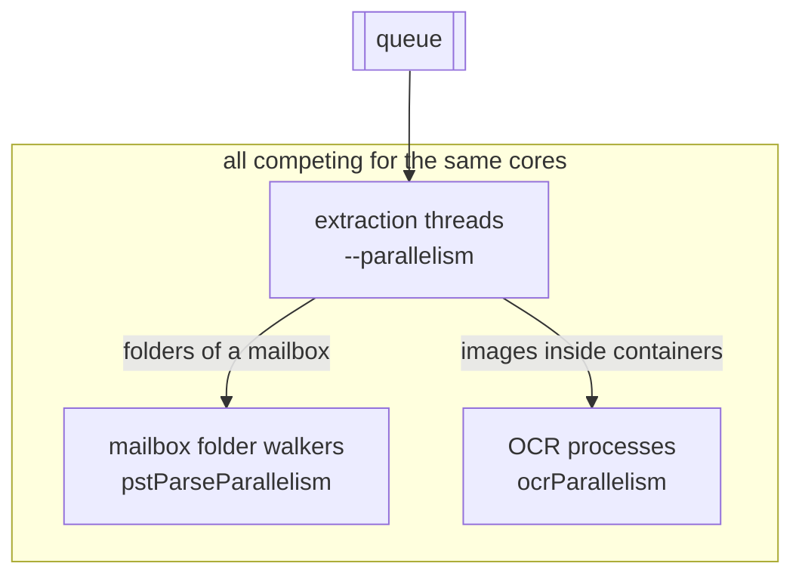

# Tuning and performance

Indexing is CPU-bound. Text extraction and OCR spend their time in parsers and in Tesseract, not waiting on disk. That single fact explains most of the advice below: you tune indexing by matching the number of concurrently running threads to the number of cores you actually have, then by not doing work you do not need.

## The single most important setting

Tesseract is built with OpenMP, so **every** Tesseract process tries to spread itself across **every** core. Datashare runs one extraction worker per core by default, and each worker that meets an image spawns a Tesseract. Left alone on a 16-core machine, that is 16 processes each asking for 16 threads: 256 threads fighting over 16 cores.

The rule is:

> **`--parallelism` = number of cores, `OMP_THREAD_LIMIT` = 1**

One extraction thread per core, one OCR thread per extraction thread.

Measured on a 10-core machine over the same set of 119 scanned PDFs:

| `--parallelism` | `OMP_THREAD_LIMIT` | Wall time | Relative |
| --------------- | ------------------ | --------- | -------- |
| 10 | unset (unbounded fan-out) | 520 s | 31x slower |
| **10** | **1** | **16.8 s** | **fastest** |
| 8 | 1 | 16.8 s | same |
| 5 | 1 | 23.8 s | 1.4x slower |
| 10 | 2 | 140 s | 8.4x slower |
| 1 | 10 | 109 s | 6.5x slower |

Two things to take away:

* **Oversubscription is far more expensive than undersubscription.** Going from one OCR thread to two per worker cost 8x. Leaving half the cores idle cost 1.4x. When in doubt, use fewer threads.
* **Parallelism across documents beats parallelism inside one image.** Tesseract barely speeds up when given more threads for a single image (about 9% for ten times the threads), so the throughput comes from running many documents at once.

`OMP_THREAD_LIMIT=1` and `OMP_WAIT_POLICY=passive` are exported by the `datashare` launcher and by the Docker entrypoint, so a standard install already does the right thing. **If you run the jar directly or from your own systemd unit, export them yourself:**

```ini
[Service]
Environment="OMP_THREAD_LIMIT=1"
Environment="OMP_WAIT_POLICY=passive"
```

Check it took effect while indexing is running:

```bash
ps -eo comm,nlwp | grep tesseract | head
```

`NLWP` is the thread count per process. It should be 1. If it is 4 or more, the variable is not reaching Tesseract.

If you also lower `--ocrTimeout`, oversubscription stops being merely slow and starts losing documents: in a test with a 120 second OCR timeout, 50 of 60 scanned images timed out and none of the 60 were indexed. With the same files and `OMP_THREAD_LIMIT=1`, all 60 were indexed in 48 seconds.

### How many Tesseract processes actually run

Two paths spawn Tesseract, and they have separate limits:

* **Loose images** are OCR'd on the extraction thread that picked them up, so up to `--parallelism` at a time.
* **Images inside containers** (attachments, images embedded in documents) are handed to a shared OCR pool whose size is `ocrParallelism`, a settings-file key that defaults to the number of cores.

With `OMP_THREAD_LIMIT=1` each of those is a single-threaded process, so the machine stays sane either way. On a corpus that mixes many loose images with many containers, lowering `ocrParallelism` to about half the core count leaves room for the extraction threads.

## OCR

OCR is the most expensive thing Datashare does, and it is enabled by default.

**Decide, do not inherit the default:**

* Corpus of born-digital files (PDFs exported from Word, Office documents, emails without scanned attachments)? Run with `--ocr false`. Indexing gets several times faster and you lose nothing.
* Corpus of scans, photographed documents or mail archives with photo attachments? Keep OCR on, and budget days rather than hours.
* Not sure? Index a representative subdirectory both ways and compare the amount of text extracted.

**Install the right languages.** Tesseract with the wrong language pack does not fail, it produces bad text. That is worse than an error because nothing tells you. Install the languages your corpus actually uses and pass them:

```bash
sudo apt install tesseract-ocr-fra tesseract-ocr-deu
tesseract --list-langs
datashare stage run --stages SCAN,INDEX --ocrLanguage fra+deu ...
```

**Use `--ocrStrategy AUTO` for scanned PDFs.** The default never renders a PDF page, so a scanned PDF has its embedded page images OCR'd as separate child documents rather than as the document itself. `AUTO` renders and OCRs whole pages, which is slower but gives the result users expect. See [Options](options.md#text-extraction-and-ocr).

## Parallelism and machines

* Set `--parallelism` to the number of cores, or one or two below it to leave room for the operating system. There is no benefit past the core count.
* **Physical cores, not hyper-threads.** OCR gets little from simultaneous multithreading, so a machine advertising 32 threads on 16 physical cores behaves like a 16-core machine. Check with `lscpu | grep -E 'Thread|Core'`.
* **Prefer compute-optimized machines.** Indexing loose files uses far less RAM than people expect. Paying for memory instead of cores is the most common sizing mistake.
* **More machines beat one bigger machine.** The INDEX stage is queue-fed and idempotent, so adding a machine adds throughput almost linearly, until Elasticsearch becomes the limit. See [scenario 5](scenarios.md#scenario-5-distribute-indexing-across-several-machines).
* **Do not extrapolate, measure.** Bring up one machine of the candidate type, point it at the same queue as an existing one, and compare documents indexed per hour over 30 minutes. That is a fair comparison because both drain the same work.

Measuring throughput needs nothing more than a counter and a clock:

```bash
watch -n 60 "curl -s 'http://elasticsearch:9200/my-project/_count' \
  -H 'Content-Type: application/json' \
  -d '{\"query\":{\"term\":{\"type\":\"Document\"}}}' | jq .count"
```

## Memory

Two processes need heap, and they compete: Datashare and Elasticsearch.

```bash
DS_JAVA_OPTS="-Xms2g -Xmx4g" ES_JAVA_OPTS="-Xms4g -Xmx8g" datashare stage run --stages INDEX ...
```

Starting points:

* When Elasticsearch runs on the same machine, roughly two thirds of the RAM to Elasticsearch and one third to Datashare is a reasonable split.
* When Elasticsearch is remote, Datashare itself needs surprisingly little. A run over loose files rarely uses more than a few GB, whatever you reserve. The page cache uses the rest, which is exactly where you want it.
* Large mail archives and deeply nested archives are the exception: they hold more structure in memory. Give them 8 GB or more.
* Add `-XX:+ExitOnOutOfMemoryError` to `DS_JAVA_OPTS` on unattended runs. A JVM that dies cleanly can be restarted by systemd, and it resumes from the report map. A JVM in a garbage-collection death spiral looks like a hang and makes no progress.

`--maxContentLength` (20 MB by default) bounds how much text a single document can contribute. Raising it a lot on a corpus with multi-gigabyte text files is how runs run out of memory.

### Heap does not scale with file size

This surprises people with large mailboxes, so it is worth stating plainly: **a 40 GB PST file does not need a 40 GB heap.** Mailbox and archive readers work from the file on disk and pull what they need, and extracted text spills to temporary files once a budget is reached. What heap actually tracks is:

```
heap  ≈  --parallelism × (embedded-text budget + --maxContentLength + parser working set)
         + JVM and Elasticsearch client overhead
```

* **Embedded-text budget**: 64 MB per in-flight root document by default (`embedMemoryBudgetMb`), shared by that document's whole embedded tree. Past it, text spills to disk, and it spills early anyway once heap occupancy passes 70% (`embedMemoryPressureThreshold`).
* **`--maxContentLength`**: 20 MB of text per document being written to Elasticsearch.
* **Parser working set**: the variable that actually matters, and it depends on the format. See the table below.

So sixteen concurrent extractions cost roughly 1.5 GB of buffers plus whatever the parsers hold. The floor is set by your **largest single file in the least memory-friendly format**, not by the size of your corpus.

## Sizing by corpus shape

| Corpus | `--parallelism` | Heap (`DS_JAVA_OPTS`) | Watch out for |
| ------ | --------------- | --------------------- | ------------- |
| Loose born-digital documents (PDF, Office, email) | cores | `-Xmx4g` | Nothing much. This is the easy case. Run with `--ocr false`. |
| Loose scans and images | cores | `-Xmx4g` | CPU, not memory. `OMP_THREAD_LIMIT=1` is what matters. |
| Archives (ZIP, RAR, nested) | cores | `-Xmx4g` to `-Xmx8g` | Temporary disk, not heap. Set `java.io.tmpdir` on a big volume, and consider `maxEmbedSizeBytes`. |
| Large spreadsheets and legacy Office files | half the cores | `-Xmx8g` or more | One huge `.xlsx` or `.doc` can need gigabytes on its own. |
| A few very large mailboxes (PST, OST) | 2 to 4 | `-Xmx8g` to `-Xmx16g` | Work units, not memory. Raise `--parseTimeout`. |
| Mixed corpus | cores | `-Xmx8g` | Size for the worst case above that applies. |

Per format, what to expect:

* **PST, OST, MBOX.** Read on demand from disk, so resident memory stays modest even on very large files: a 48 GB mailbox has been parsed under a 6 GB heap without an out-of-memory error. The cost is time and work-unit shape, not RAM.
* **PDF.** Comparatively frugal in heap. Scanned PDFs are a CPU problem (OCR), not a memory one.
* **Office.** Several Office formats are parsed by building a model of the whole file in memory. A single very large spreadsheet or legacy document is the one case where file size really does translate into heap, so give the JVM headroom if your corpus contains any.
* **Archives.** Cheap in heap because entries are extracted one at a time, expensive in temporary disk because they are spooled there. `maxEmbedDepth` (20 by default) and `maxEmbedSizeBytes` (disabled by default) are your guards against decompression bombs.
* **Images.** Trivial in heap, entirely CPU.

### Threads add up on container-heavy corpora

Three pools draw on the same cores, and all three default to roughly the core count:



On a corpus of loose files that is fine, because the last two are rarely busy. On a corpus of a few large mailboxes it is the wrong shape: `--parallelism` has only a handful of work units to chew on anyway, while the two pools do the real work. Give the pools the cores and keep the extraction threads low:

```bash
# 16-core machine, corpus of large mailboxes
DS_JAVA_OPTS="-Xms4g -Xmx12g" datashare stage run \
  --stages SCAN,INDEX \
  --parallelism 4 \
  --parseTimeout 72h \
  --settings /etc/datashare/mail.conf ...
```

```properties
# /etc/datashare/mail.conf
pstFolderFanout=true
pstParseParallelism=8
ocrParallelism=8
```


`--parseTimeout` applies to one document **including its whole embedded tree**, and a very large mailbox with OCR on can easily run past the 24 hour default. When it does, the file is recorded as a timeout, which is a **terminal** status: rerunning does not retry it. Raise `--parseTimeout` before indexing large mailboxes rather than after.


## Elasticsearch

Elasticsearch is usually the first thing to saturate once you have several indexing machines.

* **Run it on its own machine** for any production instance. It competes with indexing for both CPU and page cache.
* **Give it RAM but not too much heap.** Half the machine's memory, capped around 30 GB, is the usual recommendation; the rest is more useful as file-system cache.
* **Watch for rejections.** A `429` or a bulk rejection in the Datashare log means Elasticsearch is the bottleneck, not your workers. Add nodes or reduce the number of concurrent indexers.
* Keep an eye on disk: the index typically ends up somewhere between a fraction and a multiple of the source size depending on how much text your documents hold.

## Mail-heavy corpora

Mail archives break the "one document per worker" assumption that makes everything else scale.

**One mailbox file is one queue entry.** Ten mailboxes occupy ten extraction threads, and everything else about that mailbox has to happen inside its one entry. Two mechanisms recover parallelism inside it, both on by default in recent versions:

* **Folder fan-out** walks the folders of a single mailbox in parallel. The settings keys are `pstFolderFanout` (default `true`) and `pstParseParallelism` (default: the number of cores).
* **OCR fan-out** hands image attachments to the shared OCR pool, so they are OCR'd in parallel rather than one after the other.

What stays serial is the walk of a single folder. A mailbox whose hundred thousand messages all sit in one folder therefore still behaves close to a single work unit, and that is the case where a big machine indexes a mail corpus slowly.

Two ways out, in increasing order of effort:

1. **Spread mailboxes across machines**: one shared queue, several INDEX workers, so each mailbox at least gets its own machine's worth of attention.
2. **Split mailboxes before indexing** into one file per message, which turns one work unit into thousands and makes restarts cheap. See [scenario 8](scenarios.md#scenario-8-mail-archives-pst-ost-mbox).

If you are on an older version, or if the fan-out pools are competing with your extraction threads, both are tunable from the settings file:

```properties
pstFolderFanout=true
pstParseParallelism=8
ocrParallelism=8
```

Also budget for the fact that a mailbox produces one document per message **and** one per attachment, and that attachments are often scans. A mail corpus is an OCR corpus.

## Named entity extraction

The NLP stage is cheaper than indexing but it is not free, and it behaves differently:

* **It needs heap, not cores.** CoreNLP loads a language model per language it meets and keeps it in memory. Give the process more heap than an INDEX run, 8 GB or more on a multilingual corpus, or you will spend the run in garbage collection.
* **`--nlpParallelism` only applies to the `SPACY` pipeline**, which runs in Python workers. For `CORENLP` and `OPENNLP` it does nothing.
* **Distribute it the same way as INDEX.** The stage is queue-fed and marks each document with the pipeline that processed it, so several machines can drain the same queue and a rerun picks up where it stopped.
* **Pick the cheapest pipeline that answers your question.** `EMAIL` only extracts email addresses and is very fast. `CORENLP` gives people, organizations and locations and costs much more.
* **Run it after indexing, not during.** Both stages compete for the same cores, and NLP over a partially indexed corpus has to be run again for the rest anyway.

## Language

If you know the language of your corpus, set it:

```bash
datashare stage run --stages SCAN,INDEX --language FRENCH --ocrLanguage fra ...
```

`--language` skips automatic language detection entirely. Detection runs over the extracted text of every document, so skipping it saves real time on a large corpus, and it removes a class of pathological slowdowns on documents that are not prose (minified JavaScript, one-line JSON, generated data files). Note that `--language` sets the language for **every** document in the run, so use it only on a corpus that really is monolingual.

## Storage and temporary files

* Extraction spools embedded documents to the temporary directory. On a corpus with large archives or mailboxes, `/tmp` fills up and parses start failing with "no such file" errors. Point the JVM somewhere with space: `DS_JAVA_OPTS="-Djava.io.tmpdir=/data/tmp"`.
* Keep that temporary directory **outside** `--dataDir`, otherwise the scanner walks into Datashare's own spool files.
* Network storage for the source files is fine, indexing is not I/O bound. Network storage for the Elasticsearch data directory is not.

## A tuning checklist

Before a long run:

1. `--parallelism` set to the core count, `OMP_THREAD_LIMIT=1` confirmed with `ps -eo comm,nlwp`.
2. OCR decision made deliberately, with the right language packs installed.
3. `--reportName` set, `--queueType REDIS` set.
4. Heap sized, `-XX:+ExitOnOutOfMemoryError` on for unattended runs.
5. Temporary directory on a volume with room, outside the data directory.
6. Run started under `screen`, `tmux` or a systemd unit so an SSH disconnect does not kill it.
7. A subset indexed first, and the result checked in the interface.
