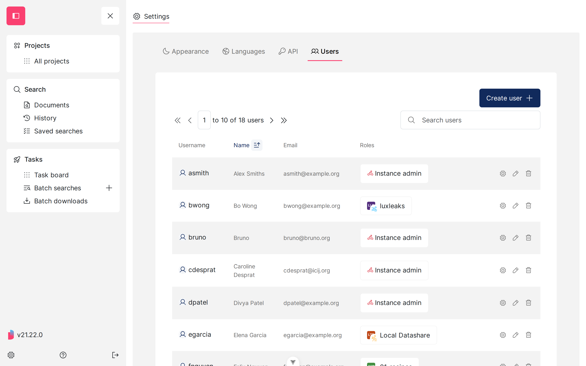
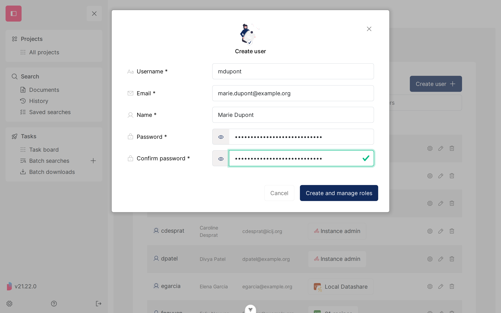
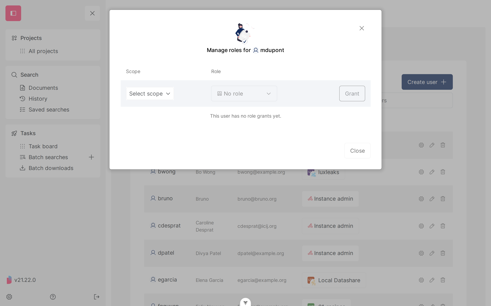
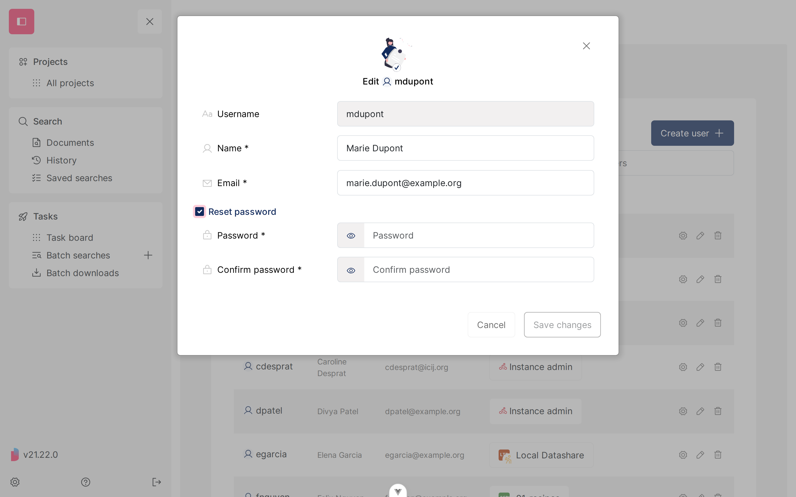
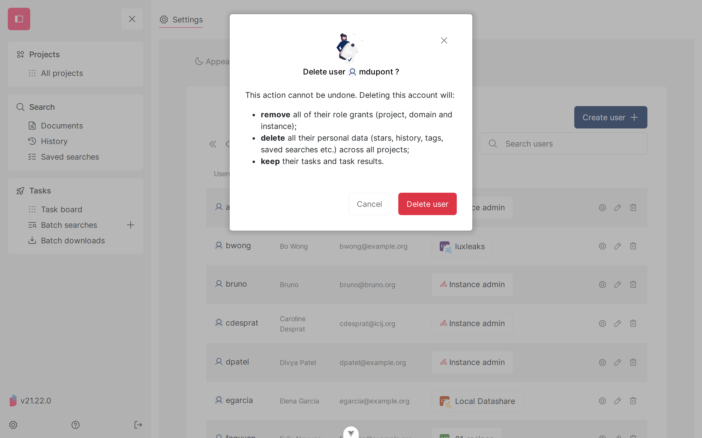

# Manage users from the UI

In **server mode**, an administrator can manage every account on the instance from **Settings > Users**, instead of (or alongside) the [`datashare user` subcommands](manage-users-from-the-cli.md).

This page is about **accounts**: who exists, and what their name, email and password are. What each account is allowed to do is a separate question, covered by the [permission model](permission-model.md).

## Where it is and who can see it

Expand the **menu**, click the **gear icon** at the bottom, then open the **'Users'** tab. Its address is `#/settings/users`.

<figure><figcaption></figcaption></figure>

Two different levels of access apply:

* **Domain admins and instance admins** see the tab and the list of accounts, and can manage each account's roles.
* **Only instance admins** can create, edit and delete accounts. For everyone else, the **'Create user'** button and the edit and delete row actions are not shown.

Anyone below domain admin who reaches the address directly sees _'You do not have access to this page.'_


The tab only exists in **server mode**. In local mode there is a single user and nothing to manage.


## The list of accounts

The table shows each account's **username**, **name**, **email** and **roles**. Click a column header to sort by it, and use the **'Search users'** field to filter on username, name or email. The pagination at the top left tells you how many accounts the instance has.

Each row ends with three actions:

* the **gear** icon opens **'Manage roles'** for that account (see the [permission model](permission-model.md));
* the **pencil** icon opens **'Edit'**;
* the **bin** icon opens **'Delete user'**.


The list loads every account before sorting and paginating. That is fine for a few hundred accounts, but it is not meant for several thousand.


## Create an account

Click **'Create user'** and fill in the four fields. All of them are required:

<figure><figcaption></figcaption></figure>

* **Username**: the login the person will type to sign in. It cannot be changed afterwards.
* **Email** and **Name**.
* **Password**, typed twice. The confirmation field turns red if the two do not match.

If the username is already taken, the form says so under the field and nothing is created. Pick another one.

Clicking **'Create and manage roles'** creates the account and opens its roles modal straight away, since a brand new account has no access to anything yet:

<figure><figcaption></figcaption></figure>

## Edit an account

Click the **pencil** icon on a row. You can change the **name** and the **email**, and tick **'Reset password'** to set a new password (typed twice, as above).

<figure><figcaption></figcaption></figure>

The **username is greyed out**: it identifies the account everywhere in Datashare, so it cannot be changed. If you need a different username, create a new account and delete the old one.

**'Save changes'** stays disabled until you actually change something.


Resetting a password here does not notify the person and does not sign them out. Tell them out of band, through a channel that is not Datashare.


## Delete an account

Click the **bin** icon on a row. The modal spells out what deleting does:

<figure><figcaption></figcaption></figure>

Deleting an account:

* **removes** all of their role grants: project, domain and instance alike. Nothing is kept in reserve, so re-creating the same username later gives you an account with no access at all, not the one you deleted.
* **deletes** all their personal data (stars, history, tags, saved searches, and so on) across every project;
* **keeps** their tasks and task results, which stay visible to administrators.

This cannot be undone.

You cannot delete your own account from this page: the bin icon is greyed out on your own row, so an instance cannot be left without the admin who is using it.

## What depends on the authentication backend

Datashare can only create, edit and delete accounts when it is the one holding them. That depends on the [`--auth` and `--authUsersProvider` flags](user-management/):

| `--auth` | Where accounts live | Settings > Users can |
| --- | --- | --- |
| `form` or `basic`, with `--authUsersProvider database` | PostgreSQL `user_inventory` table | list, create, edit, delete, manage roles |
| `form` or `basic`, with `--authUsersProvider redis` | Redis | list, create, edit, delete, manage roles |
| `oauth` | Your identity provider | list and manage roles only |
| `yesCookie`, `yesBasic` (dummy) | Nowhere, any login is accepted | nothing useful, do not use outside local development |

Under **OAuth2**, accounts are created, renamed and removed in your identity provider, not in Datashare. The **'Create user'** button and the edit and delete row actions are hidden, however high your role is. What you can still do from this page is **grant and revoke roles**, since those are Datashare's own, not your IdP's.


If the account store configured on your server cannot list accounts at all, the tab says so instead of showing an empty table: _'The users provider configured on this server can't list accounts, so they can't be shown here.'_


## See also

* [Manage users from the CLI](manage-users-from-the-cli.md), to create accounts in bulk or from a script.
* [Permission model](permission-model.md), for what each role lets an account do.
* [User management](user-management/), to choose how people sign in.
