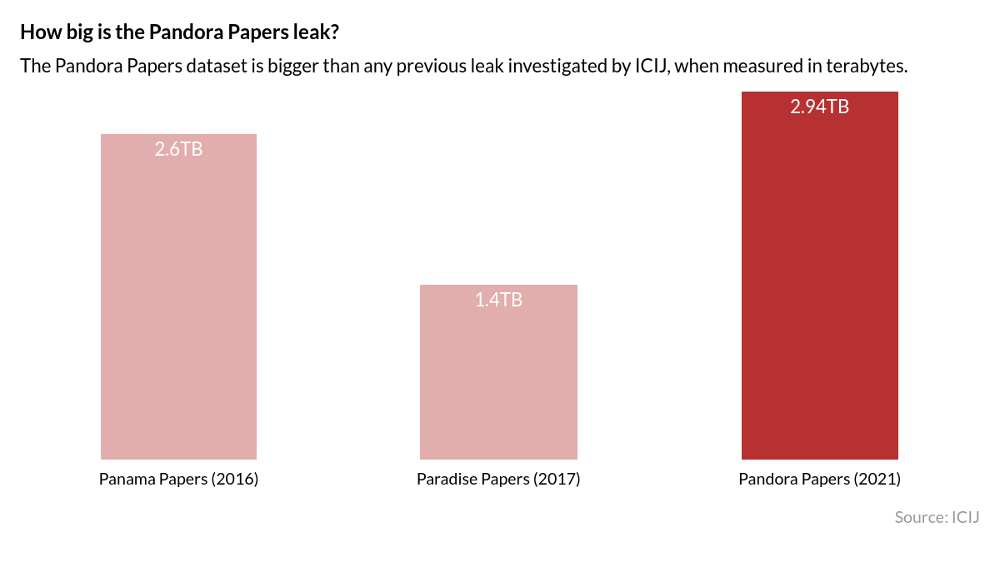

# Performance considerations

Improving the performance of Datashare involves several techniques and configurations to ensure efficient data processing. Extracting text from multiple file types and images is an heavy process so be aware that even if we take care of getting the best performances possible with [Apache Tika](https://tika.apache.org/) and [Tesseract OCR](https://tesseract-ocr.github.io/), this process can be expensive. Below are some tips to enhance the speed and performance of your Datashare setup.

### **Separate Processing Stages**

Execute the SCAN and INDEX stages independently to optimize resource allocation and efficiency.

_Examples:_

```bash
datashare stage run --stages SCAN --redisAddress redis://redis:6379 --busType REDIS
datashare stage run --stages INDEX --redisAddress redis://redis:6379 --busType REDIS
```

### **Distribute the INDEX Stage**

Distribute the INDEX stage across multiple servers to handle the workload efficiently. We often use multiple[`g4dn.8xlarge`](https://instances.vantage.sh/aws/ec2/g4dn.8xlarge) instances (32 CPUs, 128 GB of memory) with a remote Redis and a remote ElasticSearch instance to alleviate processing load.

For projects like the [Pandora Papers](https://www.icij.org/investigations/pandora-papers/) (2.94 TB), we ran the INDEX stage to up to 10 servers at the same time which cost ICIJ several thousand of dollars.\\

<figure><figcaption></figcaption></figure>

### **Leverage Parallelism**

Datashare offers `--parallelism` and `--parserParallelism` options to enhance processing speed.

_Example (for `g4dn.8xlarge` with 32 CPUs):_

```bash
datashare stage run --stages INDEX --parallelism 14 --parserParallelism 14
datashare stage run --stages NLP --parallelism 14 --nlpParallelism 14
```

### **Optimize ElasticSearch**

ElasticSearch can significantly consume CPU and memory, potentially becoming a bottleneck. For production instance of Datashare, we recommend deploying ElasticSearch on a remote server to improve performances.

### Adjust memory allocation

When Datashare starts, it also launches Elasticsearch automatically. You can modify how Datashare and Elasticsearch use the Java Virtual Machine via two environment variables:

* **`DS_JAVA_OPTS`** — JVM options dedicated to Datashare
* **`ES_JAVA_OPTS`** — JVM options dedicated to Elasticsearch

Among various options, these variables let you control memory allocation through these flags:

* **`-Xmx`** — the maximum amount of memory the process is allowed to use
* **`-Xms`** — the initial amount of memory allocated at startup&#x20;

As a starting point, we suggest allocating roughly **2/3 of your available memory to Elasticsearch** and **1/3 to Datashare**. For example, on a machine with 12 GB of RAM:

<pre class="language-shell"><code class="lang-shell"><strong>DS_JAVA_OPTS="-Xms2g -Xmx4g" <a data-footnote-ref href="#user-content-fn-1">E</a>S_JAVA_OPTS="-Xms4g -Xmx8g" datashare stage run --stages INDEX
</strong></code></pre>

These are only guidelines, the right balance depends on your documents, your workload, and what you observe in practice. If Elasticsearch becomes a bottleneck, increase its share; if Datashare itself is slow, adjust accordingly.

### **Specify Document Language**

If the document language is known, explicitly setting it can save processing time.

* **Use `--language`** for general language setting (e.g., `FRENCH`, `ENGLISH`).
* **Use `--ocrLanguage`** for OCR tasks to specify the Tesseract model (e.g., `fra`, `eng`).

_Example:_

```bash
datashare stage run --stages INDEX --language FRENCH --ocrLanguage fra
datashare stage run --stages INDEX --language CHINESE --ocrLanguage chi_sim
datashare stage run --stages INDEX --language GREEK --ocrLanguage ell
```

### **Manage OCR Tasks Wisely**

OCR tasks are resource-intensive. If not needed, disabling OCR can significantly improve processing speed. You can disable OCR with `--ocr false`.

_Example:_

```bash
datashare stage run --stages INDEX --ocr false
```

### **Efficient Handling of Large Files**

Large PST files or archives can hinder processing efficiency. We recommend extracting these files before processing with Datashare. If they are too many of them, keep in mind that Datashare will be able to extract them anyway.

_Example of splitting Outlook PST files in multiple `.eml` files with_ [_readpst_](https://linux.die.net/man/1/readpst)_:_

```shell
readpst -reD <Filename>.pst
```

[^1]: 
