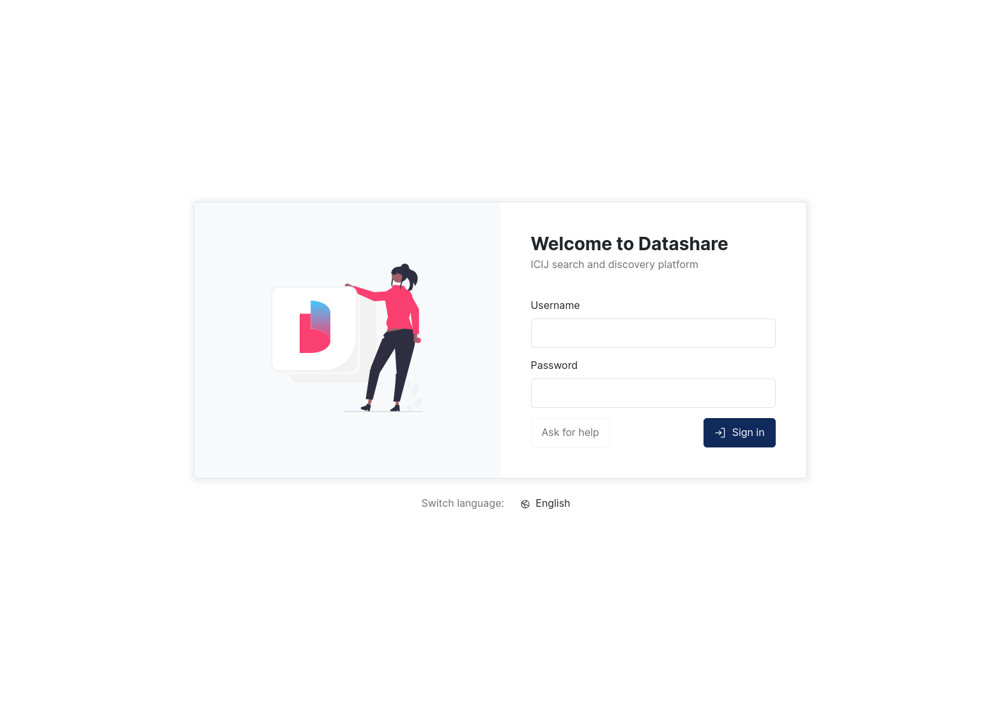

# HTML form

The form authentication method (`--auth form`) displays a login page served by Datashare's frontend. Users submit their credentials through an HTML form instead of the browser's native basic-auth popup, which gives a better user experience and lets them sign out.

This method is the **default** (used when no `--auth` flag is provided) and the **recommended** authentication provider for self-managed deployments. It replaces the legacy basic (`--auth basic`) and dummy (`--auth yesBasic`) methods.

<figure><figcaption><p>Datashare login form</p></figcaption></figure>

## How it works

When an unauthenticated user tries to access a protected URL, Datashare's frontend redirects them to the login page. The form posts credentials as JSON to `/auth/login`:

```
POST /auth/login
Content-Type: application/json

{"username": "foo", "password": "bar"}
```

On success, the server sets a session cookie and returns `200`. On failure, it returns `401`. Users can sign out by hitting `GET /auth/signout`, which clears the session. This is a feature that basic auth doesn't offer.

The session lifetime is controlled by `--sessionTtlSeconds` (default: `43200`, i.e. 12 hours).


Credentials are sent in plain text inside the request body. Always run Datashare behind TLS when using this filter.


## User provider

Form auth must be paired with a user provider that stores credentials, selected with `--authUsersProvider`:

* `database` (default): credentials stored in the Datashare database (PostgreSQL recommended).
* `redis`: credentials stored in Redis.

The user record format is the same in both cases. See [Provisioning users](README.md#provisioning-users) for how to hash passwords, structure records, and store them in PostgreSQL or Redis.

## Migrating from basic auth

If you're already running basic auth, migration is transparent:

1. Change `--auth basic` to `--auth form` (or simply drop the flag, since `form` is the default).
2. Keep the same `--authUsersProvider` (`database` or `redis`).
3. Restart Datashare.

No data migration is needed: the user records are identical.

## Example

With a PostgreSQL user inventory:

```
docker run -ti ICIJ/datashare --mode SERVER \
    --batchQueueType REDIS \
    --dataSourceUrl 'jdbc:postgresql://postgres/datashare?user=<username>&password=<password>' \
    --sessionStoreType REDIS \
    --auth form \
    --authUsersProvider database
```

With credentials stored in Redis:

```
docker run -ti ICIJ/datashare --mode SERVER \
    --batchQueueType REDIS \
    --dataSourceUrl 'jdbc:postgresql://postgres/datashare?user=<username>&password=<password>' \
    --sessionStoreType REDIS \
    --auth form \
    --authUsersProvider redis
```
