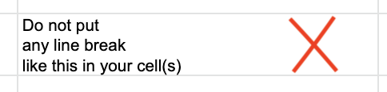
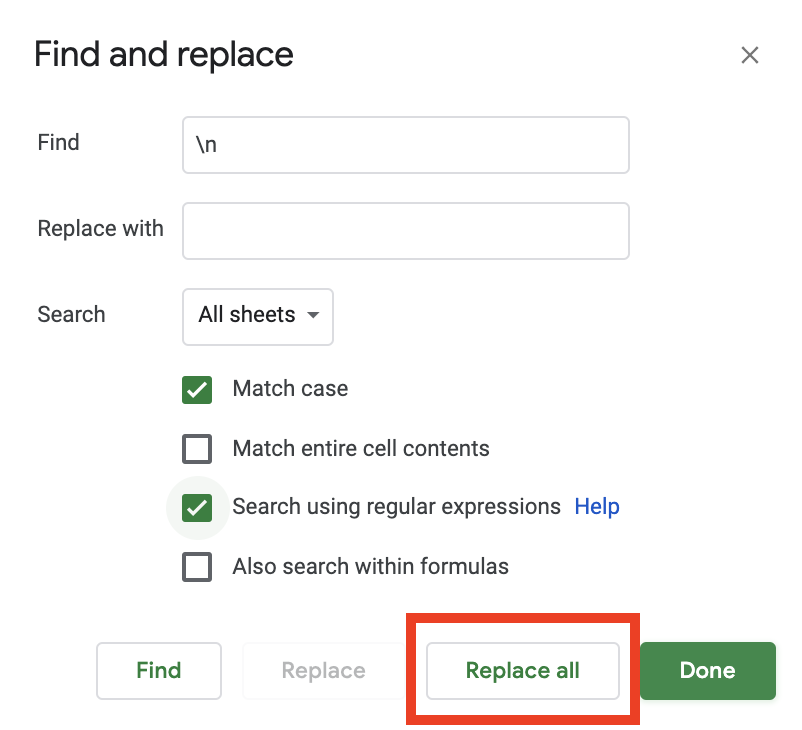
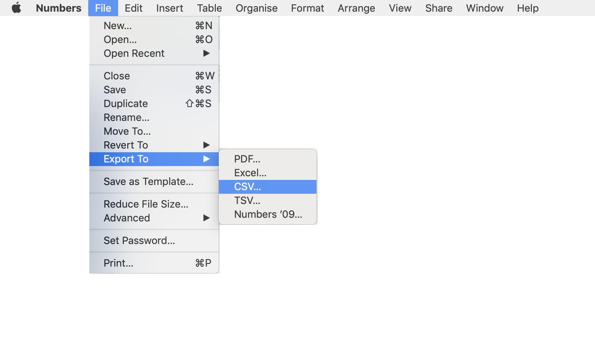
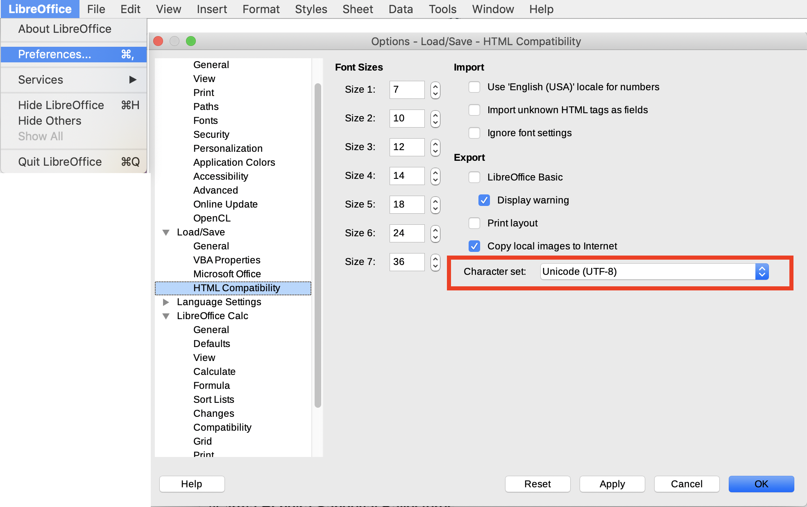

# Batch search documents



## Prepare a CSV list

Open a **spreadsheet** (LibreOffice, Framacalc, Excel, Google Sheets, Numbers, ...)

**Write your queries** in the first column of the spreadsheet, typing **one query per line**:

<figure><figcaption><p>One query per line in a spreadsheet</p></figcaption></figure>


* **Do not put line break(s)** in any of your cells.

<figure><figcaption><p>This will lead to a "failure"</p></figcaption></figure>

<figure><figcaption><p>This will lead to a "success"</p></figcaption></figure>

To delete all line breaks in your spreadsheet, use '**Find and replace all**': find all '**\n'** and replace them by **nothing or a space**.

<figure><figcaption><p>Use this functionality to delete all line break(s)</p></figcaption></figure>


* Write **2 characters minimum in each query**. If one cell contains one character but at least one other cell contains more than one, the cell containing one character will be ignored. If all cells contain only one character, the batch search will lead to a 'failure'.


* If you have **blank cells in your spreadsheet...**

<figure><figcaption><p>Blank columns in a spreadsheet</p></figcaption></figure>

...the CSV, which stand for 'Comma-separated values', will translate these blank cells into semicolons (the 'commas'). You will thus see semicolons in your batch search results:

<figure><figcaption><p>Remove blank cells in your spreadsheet in order to avoid this.</p></figcaption></figure>

To avoid that, **remove blank cells in your spreadsheet before exporting it as a CSV.**


* **If there is a comma in one of your cells** (like in 'Jane, Austen' below), the CSV will put the content of the cell in double quotes so it will search for the exact phrase in the documents:

<figure><figcaption></figcaption></figure>

<figure><figcaption></figcaption></figure>

**Remove all commas in your spreadsheet** if you want to avoid exact phrase search.


*   **Want to search only in some documents?** Use the 'Filters' step in the batch search's form (see below). Or **describe fields directly in your queries in the CSV**. For instance, if you want to search only in some documents **with certain tags**, write your queries like this:&#x20;

    <kbd>Paris AND (tags:London OR tags:Madrid NOT tags:Cotonou)</kbd>


*   **Use operators in your CSV**: AND NOT \* ? ! + - and other operators do work in batch searches as they do in the regular search bar **but only if "Do phrase match" at step 3 is turned off.** You can thus turn it off and write your queries like this for instance:

    <kbd>Paris NOT Barcelona AND Taipei</kbd> &#x20;


* Reserved characters (^ " ? ( \[ \*), when misused, can lead to **failures** **because of syntax errors.**


* Searches are **not case sensitive**: if you search 'HeLlo', it will look for all occurrences of 'Hello', 'hello', 'hEllo', 'heLLo', etc. in the documents.





## Export the list as a CSV

Export your spreadsheet of queries in a CSV format:

<figure> Export to > CSV is selected"><figcaption></figcaption></figure>

**Important: Use the** [**UTF-8 encoding**](https://en.wikipedia.org/wiki/UTF-8) **in your spreadsheet software's settings.**


* **LibreOffice Calc**: it uses UTF-8 by default. If not, go to LibreOffice menu > Preferences > Load/Save > HTML Compatibility and make sur the character set is 'Unicode (UTF-8)':

<figure><figcaption></figcaption></figure>

* **Microsoft Excel**: if it is not set by default, select "CSV UTF-8" as one of the formats, [as explained here](https://answers.microsoft.com/en-us/msoffice/forum/msoffice_excel-mso_win10-mso_365hp/save-as-csv-with-utf-8-encoding/ff94943c-db5b-42c3-8905-f86d3d8d52c2).
* **Google Sheets**: it uses UTF-8 by default. Just click "Export to" and "CSV".





## Create the batch search

Open the menu, go to '**Tasks**', open '**Batch searches**' and click the **'Plus' button** at the top right:

<figure><figcaption></figcaption></figure>

Alternatively, in the menu next to 'Batch searches', click the **'Plus' button** :

<figure> Batch searches&#x27; is highlighted"><figcaption></figcaption></figure>

The form to create a batch search opens:

<figure><figcaption></figcaption></figure>


* **Do phrase matches**' is the equivalent of double quotes: it looks for documents containing an **exact sentence or phrase**. If you turn it on, all queries will be search for their exact mention in documents as if Datashare added double quotes around each query. In that case, it won't apply any operators (AND OR, etc) that would be in the queries. If 'Do phrase match' is off, queries are searched without double quotes and with potential operators.
* What is **fuzziness**? When you run a [batch search](batch-search-documents.md), you can set the fuzziness to 0, 1 or 2. It will apply to each term in a query. It corresponds to **the maximum number of operations (insertions, deletions, substitutions and transpositions)** on _**characters**_ needed to make one _**term**_ match the other.

> kitten -> sitten (1 substitution (k turned into s) = fuzziness is 1)

> kitten -> sittin (2 substitutions (k turned into s and e turned into i) = fuzziness is 2)

If you search for similar terms (**to catch typos for example**), use fuzziness.

"_The default edit distance is 2, but an edit distance of 1 should be sufficient to catch 80% of all human misspellings. It can be specified as: quikc\~1_" (source: [Elastic](https://www.elastic.co/guide/en/elasticsearch/reference/7.0/query-dsl-query-string-query.html#_fuzziness)).

> Example: quikc\~ brwn\~ foks\~ (as the default edit distance is 2, this query will catch all quick, quack, quock, uqikc, etc. as well as brown, folks, etc.)
>
> Example: Datashare\~1 (this query will catch Datasahre, Dqtashare, etc.)


* What are **proximity searches**? When you turn on 'Do phrase matches', you can set, in 'Proximity searches', the **maximum number of operations (insertions, deletions, substitutions and transpositions)** on _**terms**_ needed to make one _**phrase**_ match the other.

> “the cat is blue” -> “the small cat is blue” (1 insertion = fuzziness is 1)

> “the cat is blue” -> “the small is cat blue” (1 insertion + 2 transpositions = fuzziness is 3)

> Example: "fox quick"\~5 (this query will catch "quick brown fox", "quick brown car thin fox" or even "quick brown car thin blue tree fox"

Once you filled all steps, click '**Create**' and wait for the batch search to complete.



## Explore your results

In the menu, click '**Batch searches**' and click the **name of the batch search** to open it:

<figure><figcaption></figcaption></figure>

See the **number of matching documents per query**:

<figure><figcaption></figcaption></figure>

Sort the queries by **number of matching documents** or by **query position** using the page settings (icon at the top right of the screen). The query position will put the query in their original order as you put them in the CSV.

To explore a query's matching documents, click its name and see the **list of matching documents**:

<figure><figcaption></figcaption></figure>

Click a document's name to open it. Use the page settings or the column's names to sort documents.



## Relaunch a batch search (optional)

If you've added new files in Datashare after you launched a batch search, you might want to relaunch the batch search to search in the new documents too.&#x20;

The relaunched batch search will apply to newly indexed documents _and_ previously indexed documents (not only the newly indexed ones).

In 'Batch searches', go at the end of the table and click the '**Relaunch**' icon:

<figure><figcaption></figcaption></figure>

Or click '**Relaunch**' in the batch search page below its name on the right panel:

<figure><figcaption></figcaption></figure>

Change its name, description and decide to delete current batch search after relaunch or not:

<figure><figcaption></figcaption></figure>

See your relaunched batch search in the list of batch searches:

<figure><figcaption></figcaption></figure>



### Failures

Failures in batch searches can be due to several causes.


The **first query containing an error makes the batch search fail and stop.**


Go to '**Tasks**' > '**Batch searches**' > open the **batch search with a failure status** and click the **'Red cross icon' button** on the right panel:

<figure><figcaption></figcaption></figure>

Check the **first failure-generating query** in the error window:

<figure><figcaption></figcaption></figure>

Here it says:

```
Unexpected char 106 at (line no=1, column no=81, offset=80)
```

The first line contained a **comma** while it shouldn't. Datashare interpreted this query as a **syntax error**, it thus failed so the batch search stopped.&#x20;

Check [**the most common syntax errors**](faq/common-errors/your-search-query-is-wrong.md)**.**

We recommend to remove the commas, as well as any reserved characters, in your CSV using 'Find and replace all' features in your spreadsheet software and re-create the batch search.

### 'elasticsearch: Name does not resolve'

If you have a message which contain '_elasticsearch: Name does not resolve_', it means that Datashare can't make Elastic Search, its search engine, work.

In that case, you need to **re-open Datashare**: check how for [Mac](../local-mode/install-datashare-on-mac/open-datashare-on-mac.md), [Windows](../local-mode/install-datashare-on-windows/open-datashare-on-windows.md) or [Linux](../local-mode/install-datashare-on-linux/open-datashare-on-linux.md).

Example of a message regarding a problem with ElasticSearch:

<kbd>`SearchException: query='lovelace' message='org.icij.datashare.batch.SearchException: java.io.IOException: elasticsearch: Name does not resolve'`</kbd>


### 'Data too large'

One of your queries can lead to a 'Data too large' error.

It means that this query had too many results or in their results, some documents that were too big to process for Datashare. This makes the search engine fail.

We recommend to **remove the query responsible for the error and re-start your batch search without the query which led to the 'Data too large' error.**




