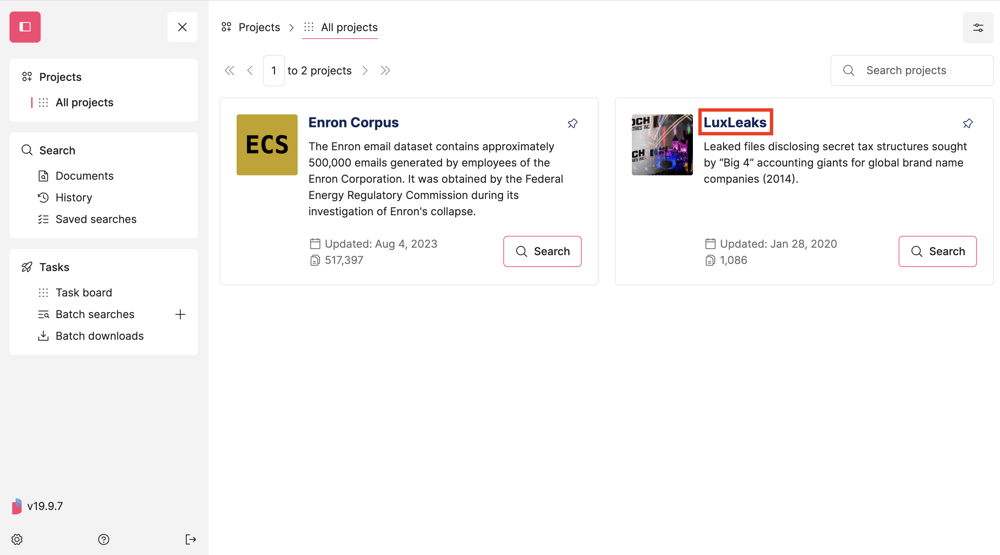
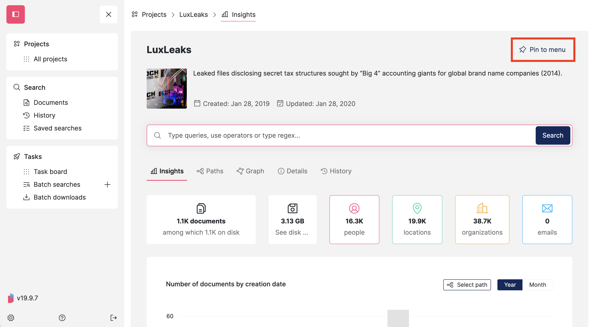
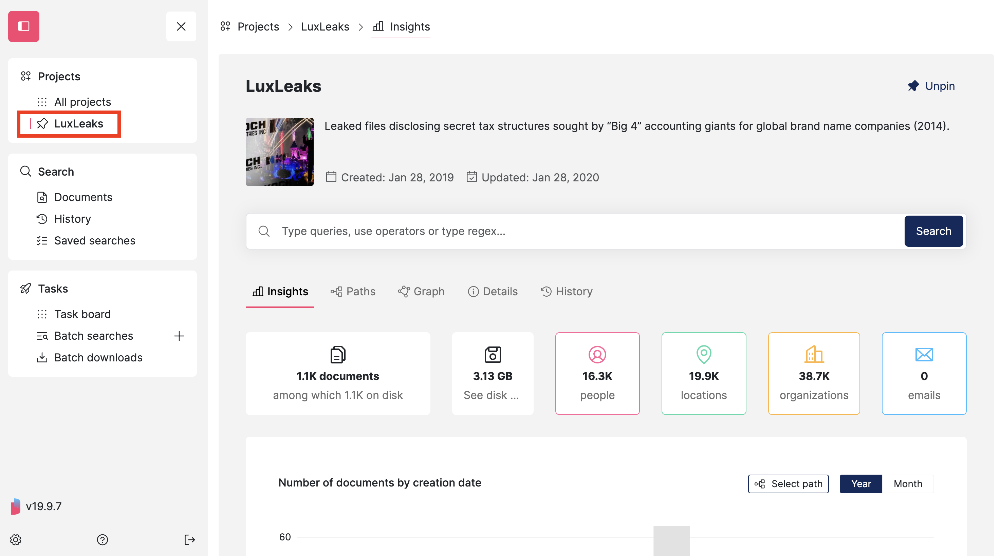
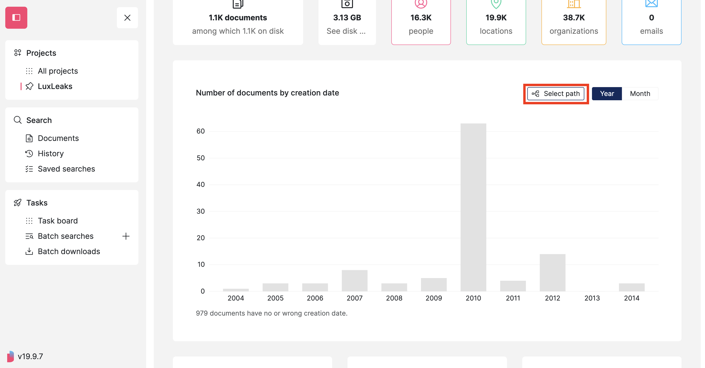
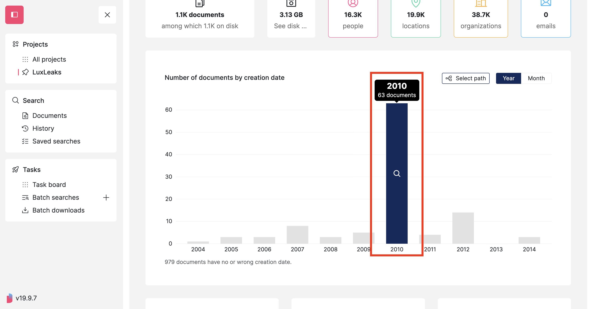
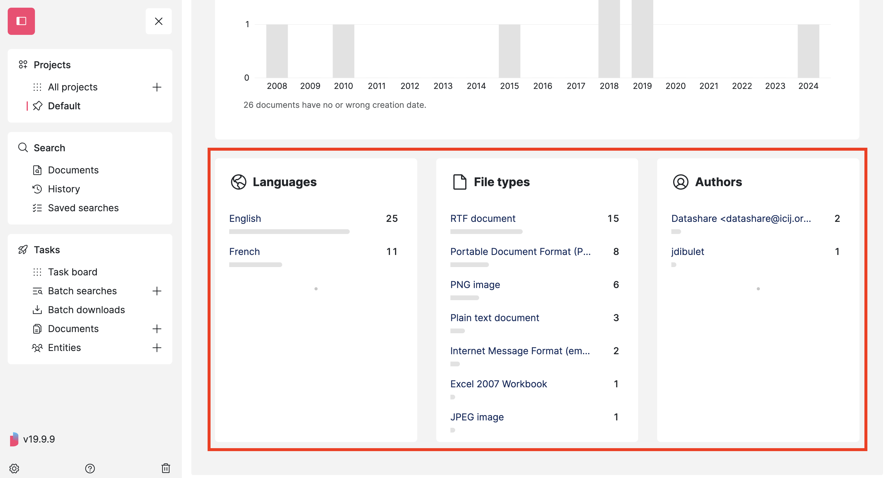
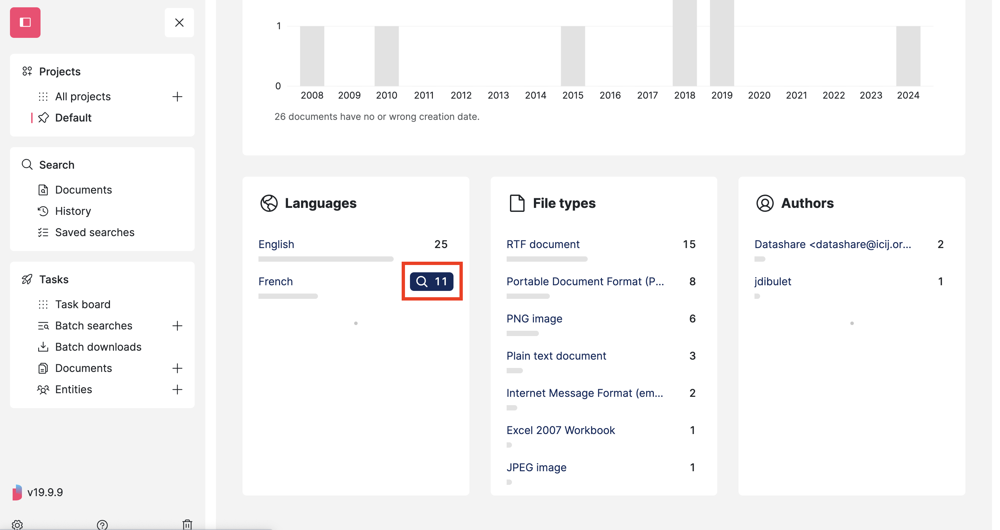
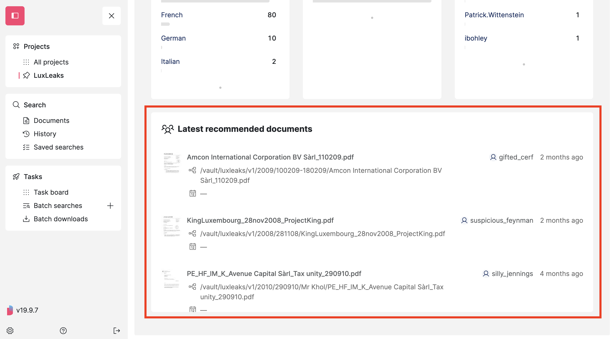

# Explore a project

Expand the **menu**, open **'All projects**' and click on the **name of the project** that you want to explore:

<figure><figcaption></figcaption></figure>

If you'd like to pin this project in the menu for an easy access, click '**Pin to menu**':

<figure><figcaption></figcaption></figure>

Your project is now pinned in the menu:

<figure><figcaption></figcaption></figure>

In a project page, in the first tab called '**Insights**', you find **statistics** and a bar chart displaying the **number of documents by creation date**.&#x20;

Filter this chart by path by clicking **'Select path'**:

<figure><figcaption></figcaption></figure>

**Click on one bar for a year or month** to see all the corresponding documents:

<figure><figcaption></figcaption></figure>

On the **'Languages', 'File Types' and 'Authors' widgets**, you see stats:

<figure><figcaption></figcaption></figure>

**Search all documents with a specific criteria**, for instance here with the French language:

<figure><figcaption></figcaption></figure>

Finally, in the server collaborative mode, you see the **Latest recommended documents**, that is to say the documents marked as recommended by other members of the project:

<figure><figcaption></figcaption></figure>

You can now [search documents](search-documents.md).
