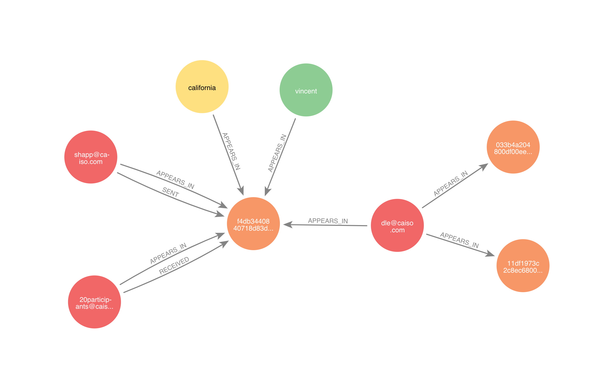
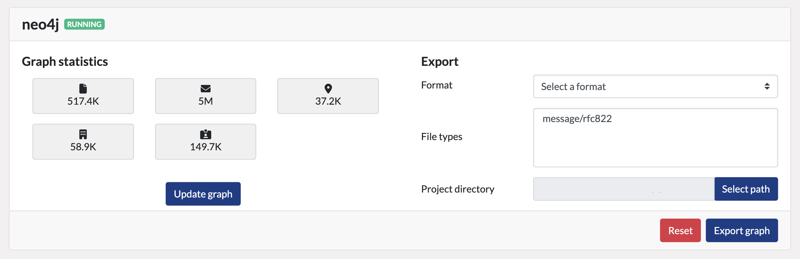
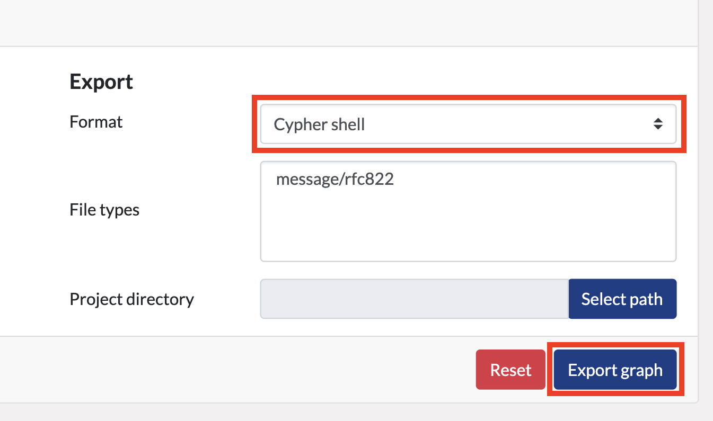
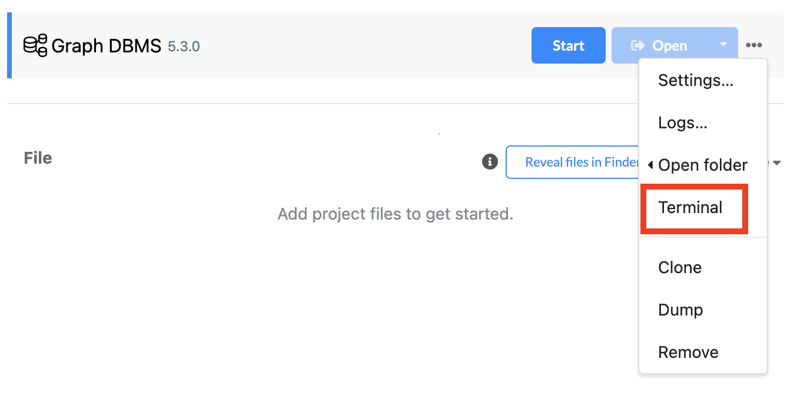
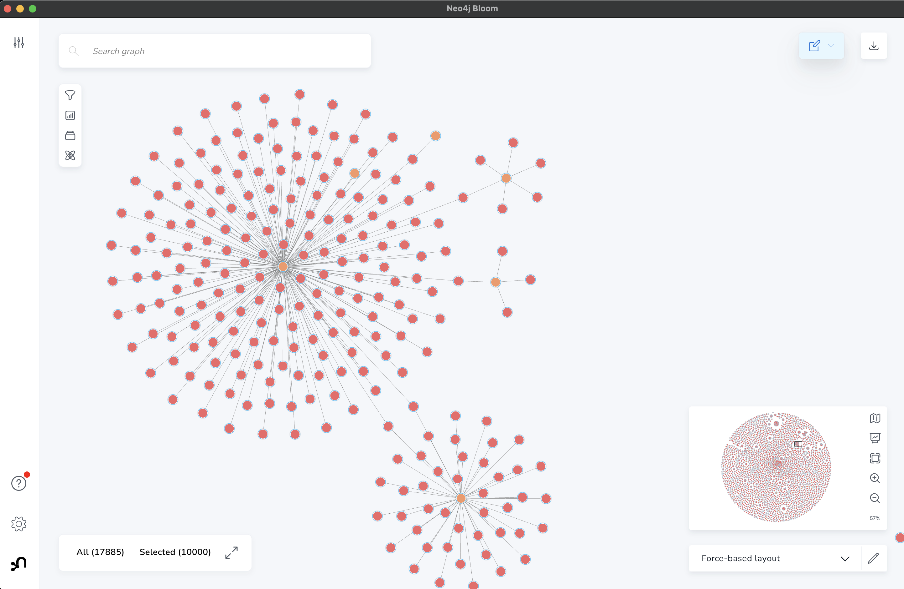
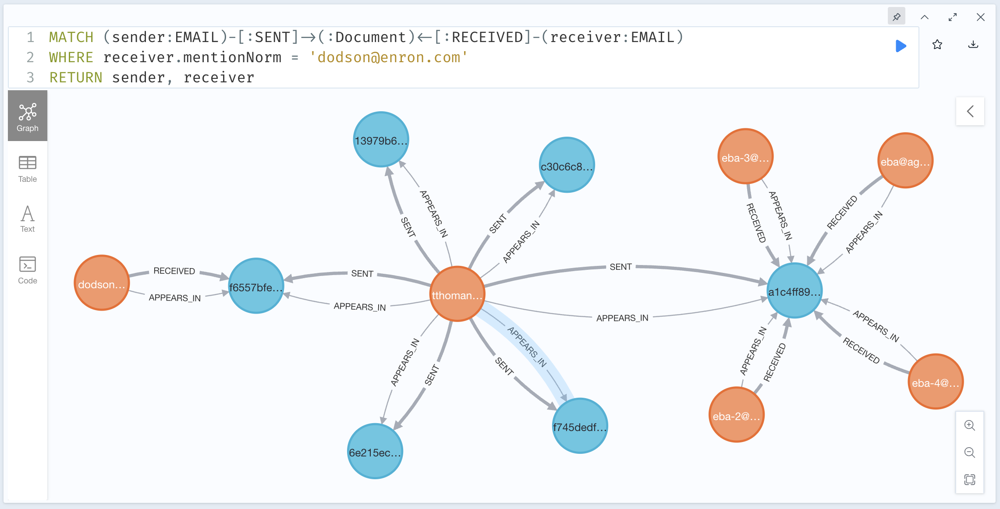

# Explore your project using [neo4j](https://neo4j.com/)

## The documents and entities graph

[neo4j](https://neo4j.com/) is a graph database technology which lets you represent  your data as a graph.
Inside Datashare, neo4j lets you connect entities between them through documents in which they appear.

After creating a graph from your Datashare project, you will be able to explore it and visualize these kinds of relationships between you project entities:   



In the above graph, we can see 3 email document nodes in orange, 3 email address nodes in red, 1 person node in green and 1 location node in yellow.
Reading the relationship types on the arrows, we can deduce the following information from the graph:
- `shapp@caiso.com` emailed `20participants@caiso.com`, the sent email has an id starting with `f4db344...`
- one person named `vincent` is mentioned inside this email, as well as the `california` location
- finally, the email also mentions the `dle@caiso.com` email address which is also mentioned in 2 other email documents (with id starting with `11df197...` and `   033b4a2...`)


If you are not familiar with graph and neo4j, take a look at the following resources:
- [Get started with neo4j](https://neo4j.com/docs/getting-started/)
- Find out [what is a graph database?](https://neo4j.com/docs/getting-started/get-started-with-neo4j/graph-database/)
- Learn [neo4j fundamentals](https://graphacademy.neo4j.com/courses/neo4j-fundamentals/)
- Check out [how to use neo4j for investigative journalism](https://www.youtube.com/watch?v=NIzx3kVUAJk&list=PL9Hl4pk2FsvVbW2t5P1DgRifG0_kuNCu_)


### Graph nodes

The neo4j graph is composed of `:Document` nodes representing Datashare documents and `:NamedEntity` nodes representing entities mentioned in these documents. 

The `:NamedEntity` nodes are additionally annotated with their entity types: `:NamedEntity:PERSON`, `:NamedEntity:ORGANIZATION`, `:NamedEntity:LOCATION`, `:NamedEntity:EMAIL`...    


### Graph relationships

In most cases, an entity `:APPEARS_IN` a document, which means that it was detected in the document content.
In the particular case of email documents and `EMAIL` addresses, it is most of the time possible to identify richer relationships from the email metadata, such as who sent (`:SENT` relationship) and who received (`:RECEIVED` relationship) the email.

When an `:EMAIL` address entity is neither `:SENT` or `:RECEIVED`, like it is the case in the above graph for `dle@caiso.com`, it means that the address was mentioned in the email document body. 

When a document is embedded inside another document (as an email attachment for instance), the child document is connected to its parent through the `:HAS_PARENT` relationship.


## Create your Datashare project's graph

The creation of a neo4j graph inside Datashare is supported through a plugin.
To use the plugin to create a graph, follow these instructions:
- when using Datashare [on your computer](../local-mode/create-the-neo4j-graph/README.md)
- when Datashare is running [on your server](../server-mode/create-the-neo4j-graph/README.md)

After the graph is created, navigate to the '**Projects'** page and select your project.
You should be able to visualize a new neo4j widget displaying the number of documents and entities found inside the graph:




## Access your project's graph

Depending on your access to the neo4j database behind Datashare, you might need to export the neo4j graph and import it locally to access it from [visualization tools](#explore-and-visualize-entity-links).   

Exporting and importing the graph into your own DB is also useful when you want to perform write operations on your graph without any consequences on Datashare.

### With read access to Datashare's neo4j database

If you have read access to the neo4j database (it should be the case if you are running Datashare on your computer), you will be able to plug [visualization tools](#explore-and-visualize-entity-links) to it and start exploring.

### Without read access to Datashare's neo4j database
If you can't have read access to the database, you will need to export it and import it into your own neo4j instance (running on your laptop for instance).

#### Ask for a DB dump

If it's possible, ask you system administrator for a DB dump obtained using the [neo4j-admin database dump command](https://neo4j.com/docs/operations-manual/current/backup-restore/offline-backup/).

#### Export your graph from Datashare
In case you don't have access to the DB and can't be provided with a dump, you can export the graph from inside. Be aware that limits might be applied on the size of the exported graph.

To export the graph, navigate to Datashare's '**Projects'** page, select your project, select the '**Cypher shell'** export format and click the '**Export graph'** button:



In case you want to restrict the size of the exported graph, you can restrict the export to a subset of documents and their entities using the '**File types'** and '**Project directory**' filters.


##### DB import
Depending on [how you run neo4j on your laptop](faq/general/how-to-run-neo4j.md) use one of the following ways to import your graph into your DB:

###### Docker
- identify your neo4j instance container ID:
    ```bash
    docker ps | grep neo4j # Should display your running neo4j container ID
    ```
- copy your the graph dump inside your neo4j container import directory:
    ```bash 
    docker cp \
        <export-path> \
        <neo4j-container-id>:/var/lib/neo4j/imports/datashare-graph.dump
    ```
- import the dumped file using the [cypher-shell](https://neo4j.com/docs/operations-manual/current/tools/cypher-shell/) command: 
    ```bash 
    docker exec -it <neo4j-container-id> /bin/bash
    ./bin/cypher-shell -f imports/datashare-graph.dump 
    ```

###### Neo4j Desktop import
- open '**Cypher shell'**:


  
- copy your the graph dump inside your neo4j instance import directory:
    ```bash 
    cp <export-path> imports
    ```

- import the dumped file using the [cypher-shell](https://neo4j.com/docs/operations-manual/current/tools/cypher-shell/) command: 
    ```bash
    ./bin/cypher-shell -f imports/datashare-graph.dump 
    ```

You will now be able to explore the graph imported in your own neo4j instance. 


## Explore and visualize entity links

Once your graph is created and that you can access it (see [this section ](#importing-a-graph-into-your-own-neo4j-instance) if you can't access the Datashare's neo4j instance), you will be able to use your favorite tool to extract meaningful information from it.


### Connect to your database

Once you can [access your neo4j database](#access-your-projects-graph), you can use different tools to visualize and explore it.
You can start by connection the [Neo4j Desktop](https://neo4j.com/docs/desktop-manual/current/visual-tour/) to your DB.  


### Visualize and explore with Neo4j Bloom

[Neo4j Bloom](https://neo4j.com/product/bloom/) is a simple and powerful tool developed by neo4j to quickly visualize and query graphs, **if you run Neo4j Enterprise Edition**.
Bloom lets you navigate and explore the graph through a user interface similar to the one below:



Neo4j Bloom is accessible from inside Neo4j Desktop app.

Find out more information about to use Neo4j Bloom to explore your graph with:
- Bloom's [User Guide](https://neo4j.com/docs/bloom-user-guide/current/about-bloom/)
- Bloom's [Quick Start](https://neo4j.com/docs/bloom-user-guide/current/bloom-quick-start/)
- [this series of videos](https://www.youtube.com/playlist?list=PL9Hl4pk2FsvWqH11v_WXVNIgb4iHjqHgs) about graph exploration with Bloom


### Query the graph with Neo4j Browser

The [Neo4j Browser](https://neo4j.com/developer/neo4j-browser/) lets you run [Cypher](https://neo4j.com/developer/cypher/) queries on your graph to explore it and retrieve information from it.
Cypher is like SQL for graphs, running Cypher queries inside the neo4j browser lets you explore the results as shown below:



The Neo4j Browser is available for both Enterprise and Community distributions. You can access it:
- inside the Neo4j Desktop app when running neo4j from the [Desktop app](faq/general/how-to-run-neo4j.md#run-neo4j-desktop)
- at [http://localhost:7474/browser/](http://localhost:7474/browser/) when running neo4j [inside Docker](faq/general/how-to-run-neo4j.md#run-neo4j-inside-docker) 


### Visualize and explore with Linkurious Enterprise Explorer

[Linkurious](https://linkurious.com/linkurious-enterprise-explorer/) is a proprietary software which, similarly to Neo4j Bloom, lets you visualize and query your graph through a powerful UI.

Find out more information about Linkurious:
- [Linkurious User Manual](https://doc.linkurious.com/user-manual/latest/)
- [configure Linkurious with neo4j](https://doc.linkurious.com/admin-manual/latest/configure-neo4j/)
- [run Linkurious inside Docker](https://doc.linkurious.com/admin-manual/latest/start/#docker-linux)

### Visualize with Gephi

[Gephi](https://gephi.org/) is a simple open-source visualization software.
It is possible to export graphs from Datashare into the [GraphML File Format](http://graphml.graphdrawing.org/) and import them into Gephi.

Find out more information about:
- how to [export your graph in the GraphML format]()
- Gephi [features](https://gephi.org/features/)
- how to [get started](https://gephi.org/users/quick-start/) with Gephi


## Export your graph in the GraphML format

To export the graph in the [GraphML file format](http://graphml.graphdrawing.org/), navigate to the '**Projects'**, select your project, choose the '**Graph ML'** export format and click the '**Export graph'** button:


In case you want to restrict the size of the exported graph, you can restrict the export to a subset of documents and their entities using the '**File types'** and '**Project directory**' filters.

You will now be able to [visualize the graph using Gephi](#visualize-with-gephi) by opening the exported GraphML file in it.
