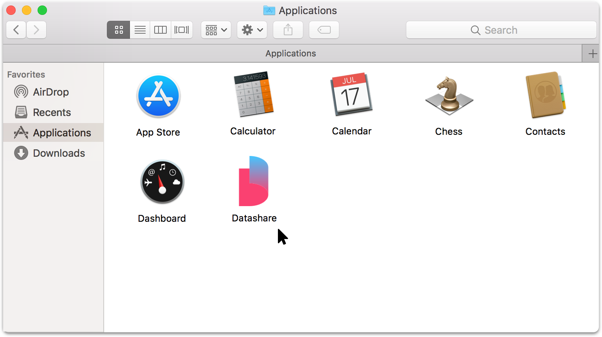

# What do I do if Datashare opens a blank screen in my browser?

If Datashare opens a blank screen in your browser, it may be for various reasons. If it does:

1. First **wait 30 seconds** and **reload the page**.
2. If the screen remains blank, **restart Datashare following instructions for** [**Mac**](../../../mac/how-to-open-datashare/)**,** [**Windows**](../../../windows/how-to-open-datashare/) **or** [**Linux**](../../../linux/how-to-open-datashare/).
3. If you still see a blank screen, please **uninstall and reinstall Datashare**

To uninstall Datashare:

On Mac, go to 'Applications' and drag the Datashare icon to your dock's 'Trash' or right-click on the Datashare icon and click on 'Move to Trash'.

<figure><figcaption></figcaption></figure>

On Windows, please follow [these steps](https://www.laptopmag.com/articles/uninstall-programs-windows-10).

On Linux, please delete the 3 containers: Datashare, Redis and Elastic Search, and the script.

**To reinstall Datashare**, see 'Install Datashare' for [Mac](../../../local-mode/install-datashare-on-mac/install-datashare.md), [Windows](../../../local-mode/install-datashare-on-windows/install-datashare.md) or [Linux](../../../local-mode/install-datashare-on-linux/install-datashare.md).
