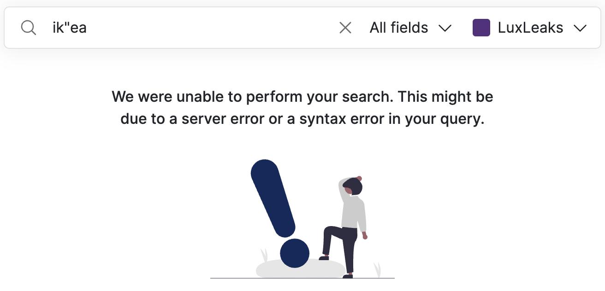
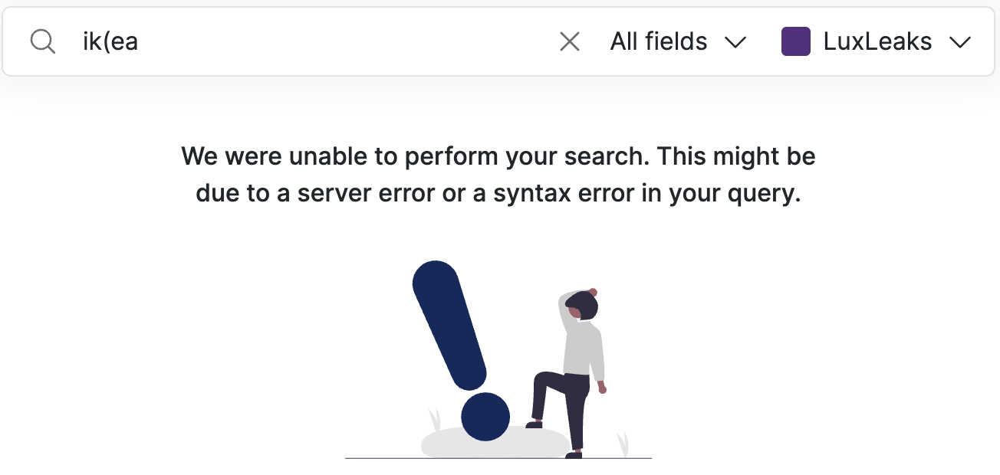
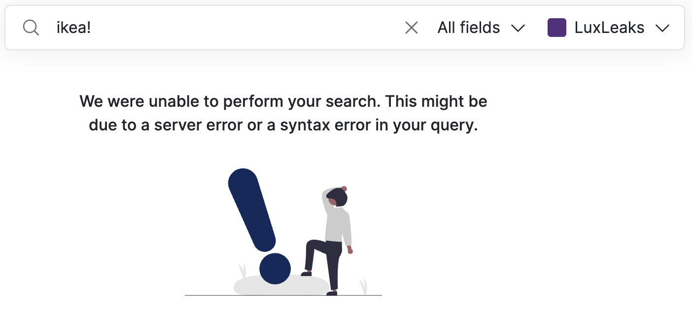
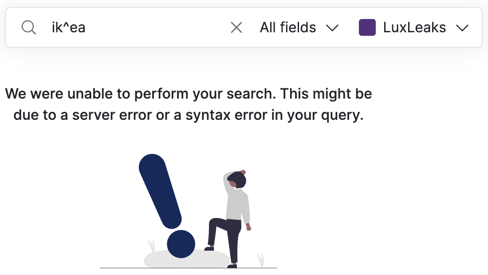

# 'We were unable to perform your search.' What should I do?

Here are **the most common errors that you should correct:** ‌

### **The query starts with AND** 

You cannot start a query with AND all uppercase. [AND is reserved as a search operator](../../search-with-operators.md#and-or).

<figure><figcaption></figcaption></figure>

### **The query starts with OR** 

You cannot start a query with OR all uppercase. [OR is reserved as a search operator](../../search-with-operators.md#or-or-space).

<figure><figcaption></figcaption></figure>

### **The query contains only one double-quote: "** 

‌You cannot start or type a query with only one double quote. [Double quotes are reserved as a search operator](../../search-with-operators.md#double-quotes-for-exact-phrase) for exact phrase.

<figure><figcaption></figcaption></figure>

<figure><figcaption></figcaption></figure>

<figure><figcaption></figcaption></figure>

### **The query contains only one parenthesis: ( or )** 

‌You cannot start or type a query with only one parenthesis. [Parenthesis are reserved for combining operators](../../search-with-operators.md#combine-operators).

<figure><figcaption></figcaption></figure>

<figure><figcaption></figcaption></figure>

<figure><figcaption></figcaption></figure>

### **The query contains only one forward slash: /**

‌You cannot start or type a query with only one forward slash. Forward slashes are reserved for regular expressions (Regex).

<figure><figcaption></figcaption></figure>

### **The query starts with or contains tilde:** \~ 

‌You cannot start a query with tilde (\~) or write one which contains tilde. Tilde is reserved as a search operator for [fuzziness](../../search-with-operators.md#fuzziness) or [proximity searches](../../search-with-operators.md#proximity-searches).

<figure><figcaption></figcaption></figure>

<figure><figcaption></figcaption></figure>

### **The query ends with question mark: !** 

You cannot end a query with question mark (!). [Question mark is reserved as a search operator for excluding a term](../../search-with-operators.md#not-or-or).

<figure><figcaption></figcaption></figure>

### **The query starts with or contains caret:** ^ 

‌You cannot start a query with caret (^) or write one which contains caret. [Caret is reserved as a boosting operator](../../search-with-operators.md#boosting-operators).

<figure><figcaption></figcaption></figure>

<figure><figcaption></figcaption></figure>

### The query **contains** square brackets: \[ or ]

You cannot use square brackets [except for searching for ranges](../../search-with-operators.md#search-with-metadata-fields).

<figure><figcaption></figcaption></figure>
