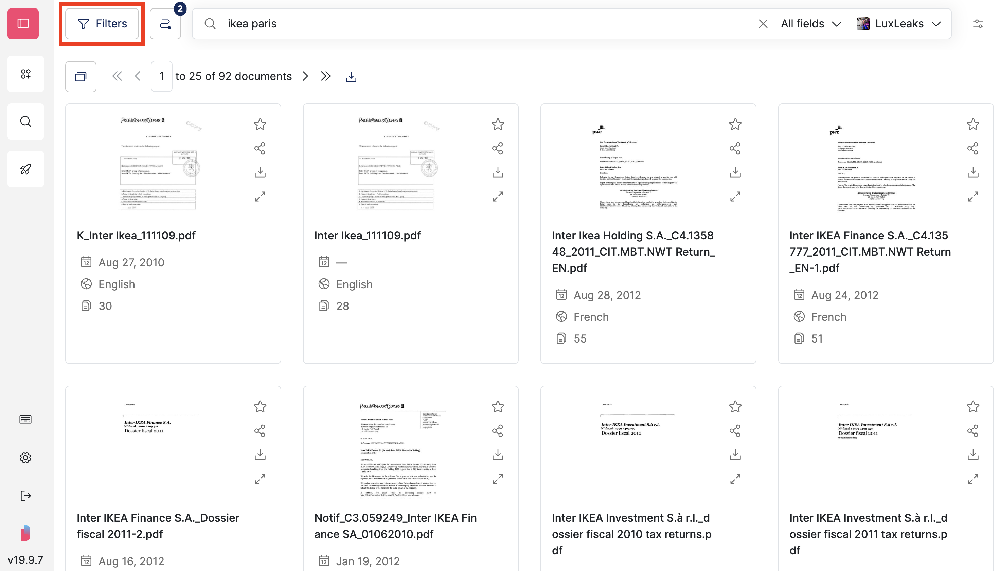
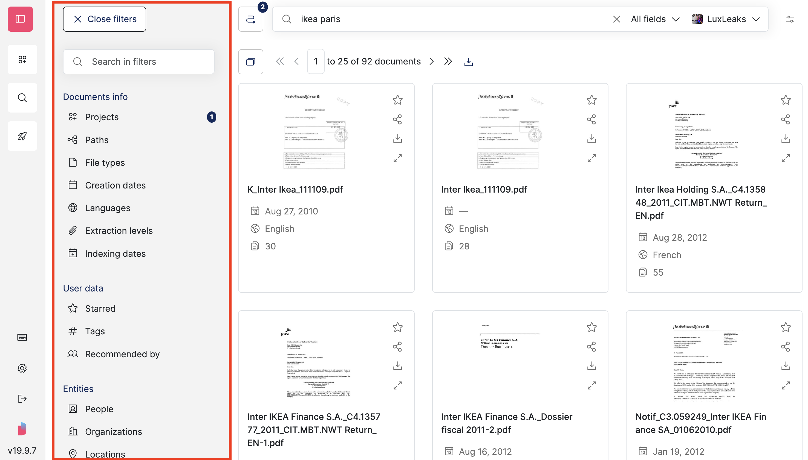
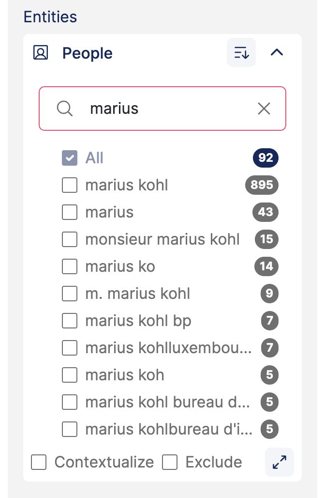
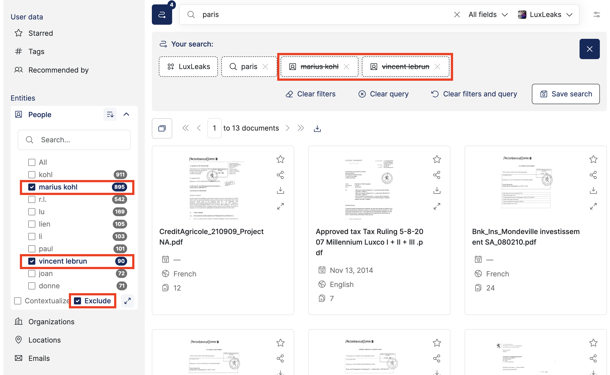
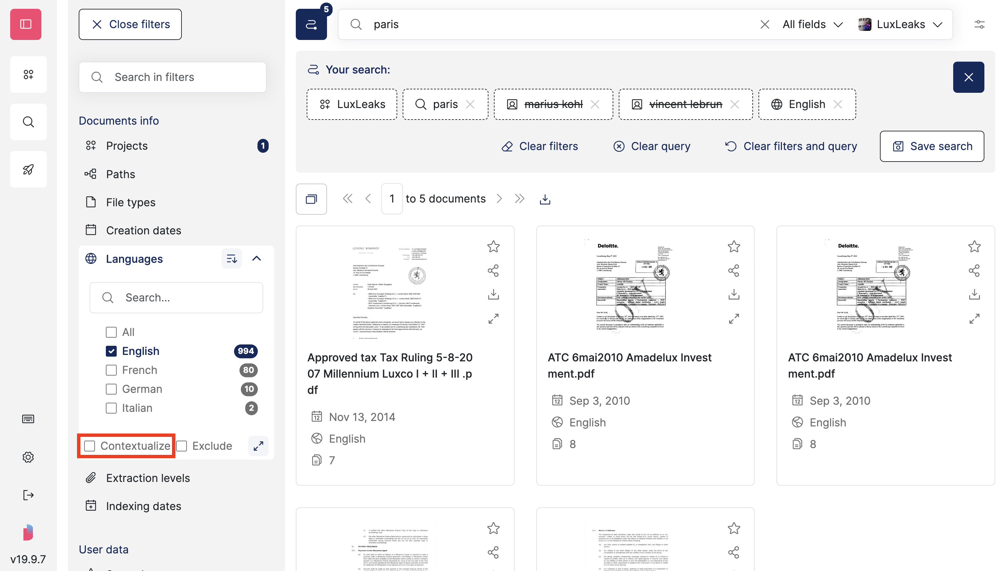
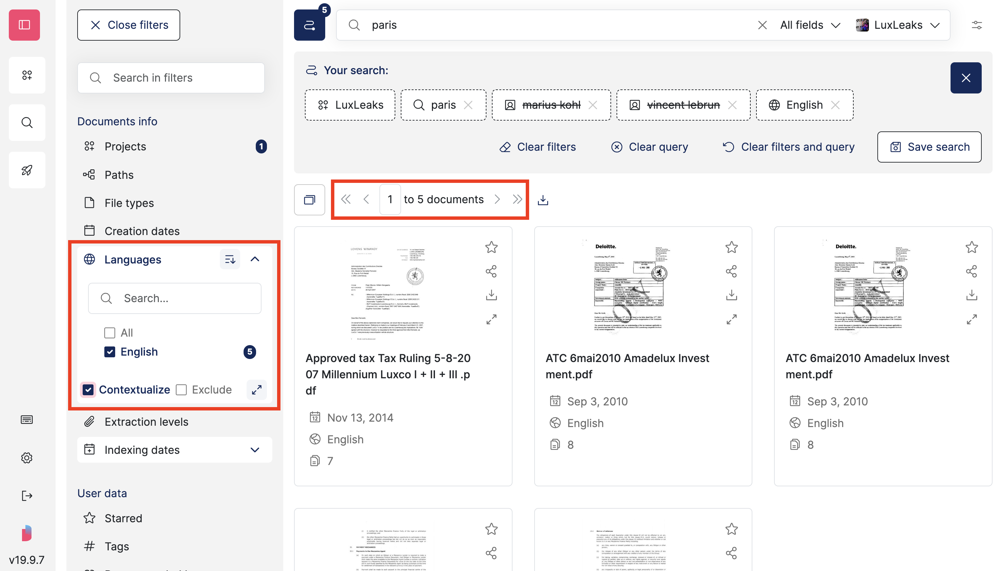
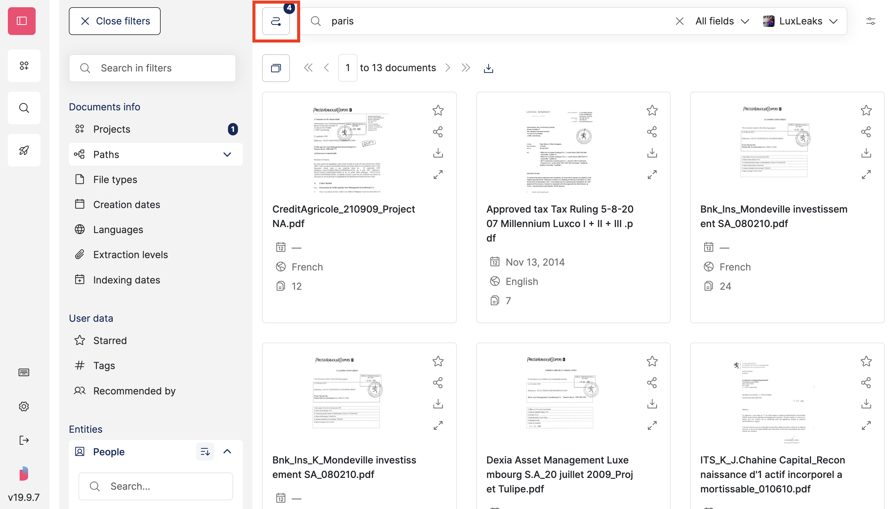
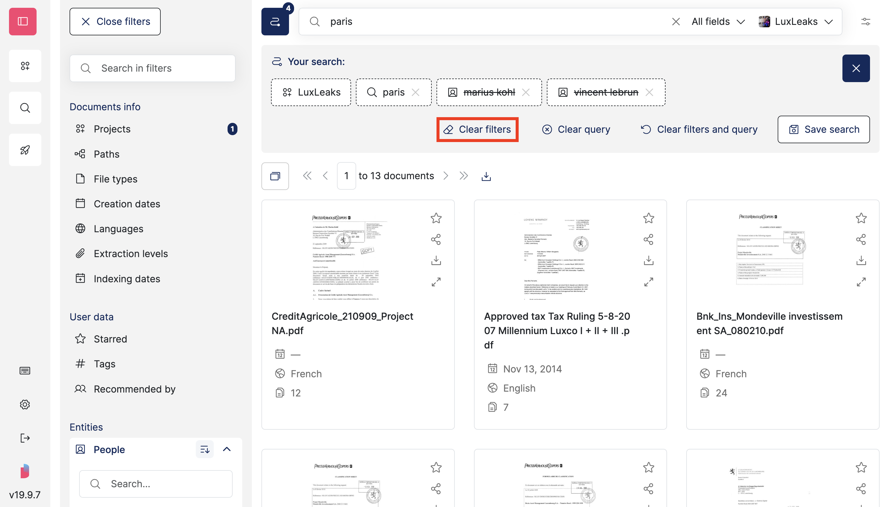

# Filter documents

## Filters

Open '**Filters**' on the left of the search bar:

<figure><figcaption></figcaption></figure>

<figure><figcaption></figcaption></figure>

**'Indexing dates'** arethe dates when the documents were added to Datashare.

**'Embedment levels'** regard embedded documents:

* The 'file on disk' is level zero
* If a document is attached to (or contained in) a file on disk, its embedment level is '1st'
* If a document is attached to (or contained in) a document itself contained in a file on disk, its embedment level is '2nd'
* And so on

## Filter by entities

If you asked Datashare to '**Find entities**' and the task was complete, you will see names of people, organizations, locations and e-mail adresses in the filters. These are the entities **automatically detected by Datashare:**

<figure><figcaption></figcaption></figure>

## Exclude filters

Tick the '**Exclude**' checkbox to select all items except those selected.

In the search breadcrumb, you see that the excluded filters are **strikethrough**:

<figure><figcaption></figcaption></figure>

## Lock filters

Locking a filter value pins it so it stays applied across searches, until you unlock it yourself. A lock is:

* **Personal**: never shared with other members, never included in a saved search, a batch search or a batch download.
* **Cross-project**: a locked value stays locked when you switch to a different project, even one where that value doesn't exist.


Locking only works on filter **values**, never on the free-text search query itself.


#### Lock a value from the Filters panel

Tick a filter value, then click its **padlock icon** to lock it:

<!-- SCREENSHOT: Filters panel with a ticked value, its padlock icon (unlocked state) highlighted on hover -->

The padlock switches to its closed/filled state once the value is locked:

<!-- SCREENSHOT: Filters panel with a locked value, closed padlock icon and the row staying visible -->

Unticking a locked value removes it **and** unlocks it at the same time. There is no way to keep a lock without keeping its value applied.


A value you locked earlier can still show up as locked even if it later disappears from the results (a deleted tag, a re-indexed path, for instance).


#### Lock a chip from the search breadcrumb

Open '**Your search**' to see the search breadcrumb, then click a chip's **padlock icon** to lock or unlock it:

<!-- SCREENSHOT: Search breadcrumb open, a chip's padlock icon highlighted -->

Locking one side of a paired filter (for instance a content type marked '**Excluded**') never locks its opposite side.

#### Apply your locked filters

A lock doesn't silently reapply itself to searches that don't already match it. For instance, right after you open a search link someone else shared with you, or start a brand-new search. Whenever at least one locked value isn't reflected in your current search, the search breadcrumb shows an '**Apply locked filters**' button:

<!-- SCREENSHOT: Search breadcrumb footer with the 'Apply locked filters' button enabled -->

Click it to instantly apply every locked value to your current search (locks always win over a conflicting value). A confirmation message tells you whether it succeeded.


If you have at least one lock active, the search breadcrumb opens automatically after you run a new search, and whenever a locked value stops matching your current search, so you always see what's locked before you read your results.


#### Clear every lock

To remove every lock at once, without touching the filter values currently applied, open the search breadcrumb and click '**Clear locks**':

<!-- SCREENSHOT: Search breadcrumb footer with the 'Clear locks' button highlighted -->

## Contextualize filters

In most filters, tick '**Contextualize'** to **update the number of documents indicated in the filters so they reflect the results**.

The filter will only count what you selected, it will reflect the results of your current selection:

<figure><figcaption></figcaption></figure>

<figure><figcaption></figcaption></figure>

## Clear all filters

To reset all filters at the same time, open the **search breadcrumb**:

<figure><figcaption></figcaption></figure>

Click '**Clear filters**':

<figure><figcaption></figcaption></figure>


'**Clear filters**' and '**Clear filters and query**' never remove a locked value. They clear every other filter and instantly re-apply your locks. To remove the locks themselves, see [Clear every lock](#clear-every-lock) above.

