# Search documents

You must have added documents in Datashare before. Check how for [Mac](../local-mode/install-datashare-on-mac/add-documents-to-datashare-on-mac.md), [Windows](../local-mode/install-datashare-on-windows/add-documents-to-datashare-on-windows.md) and [Linux](../local-mode/install-datashare-on-linux/add-documents-to-datashare-on-linux.md).

## Search bar

Expand the menu to go to '**Search**' > '**Documents**':

<figure>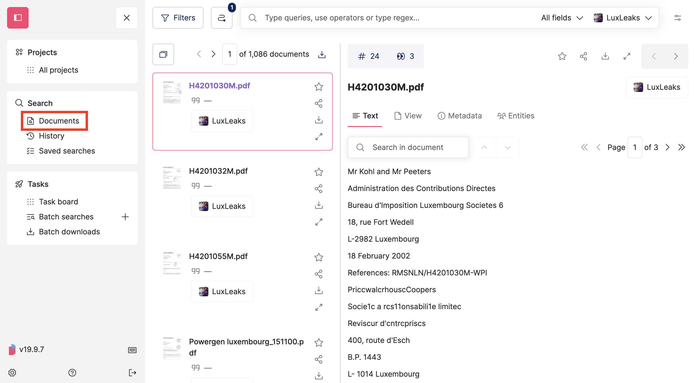<figcaption></figcaption></figure>

Make room by closing the menu:

<figure>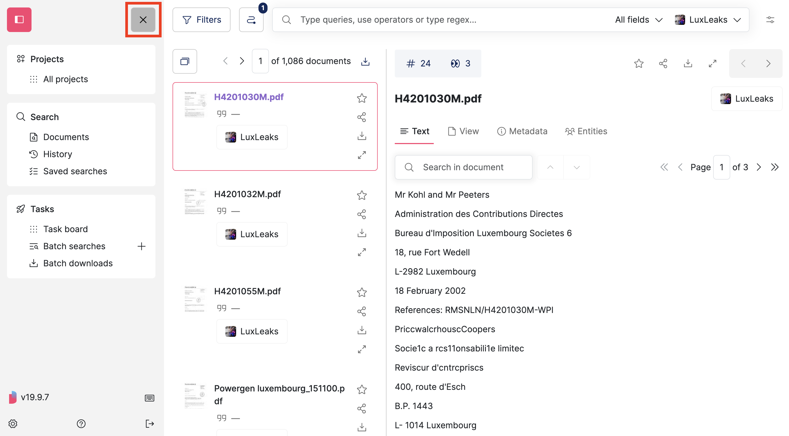<figcaption></figcaption></figure>

**Type terms** in the search bar and **press Enter**:

<figure>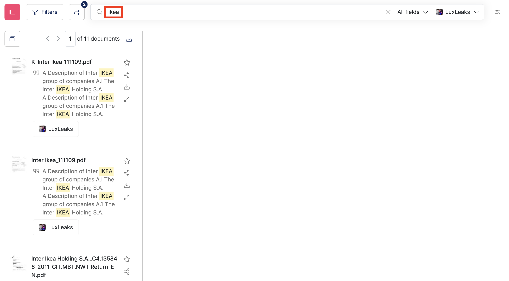<figcaption></figcaption></figure>

## Default operator is OR

If you type **several terms** separated by space, as the **default operator is OR**, Datashare will search for all documents containing at least one of the searched terms.

For instance, Datashare finds documents containing **either 'ikea' or 'paris' or both terms here**:

<figure>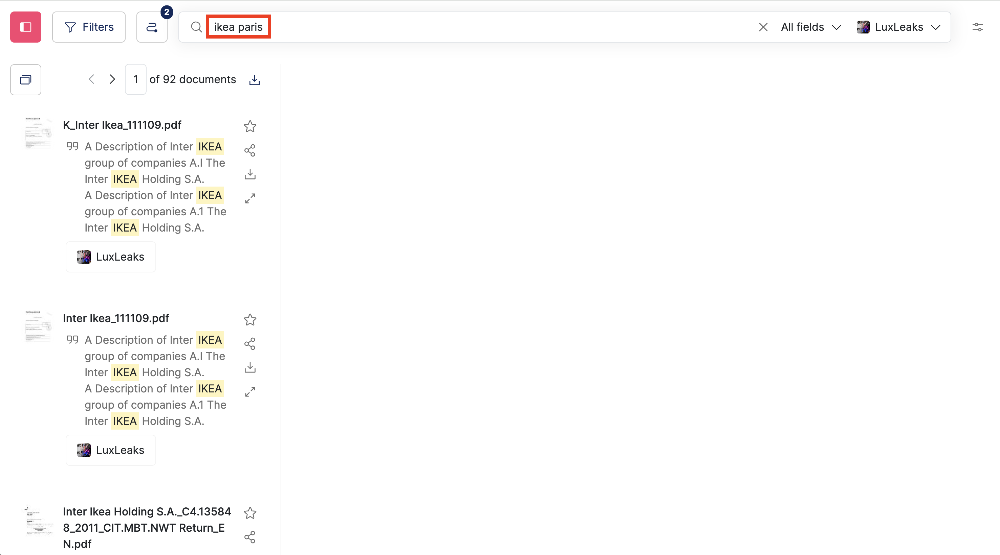<figcaption></figcaption></figure>

Switch to **AND** by changing the [results settings](https://icij.gitbook.io/datashare/usage/search-documents#results-settings).

## Linked entities

As you type a term, Datashare **suggest linked entities** - only if a task to find entities in this project was completed.

Press **Esc** on your keyboard to close the dropdown or **click on one of the entities** to replace your term in the search bar:

<figure>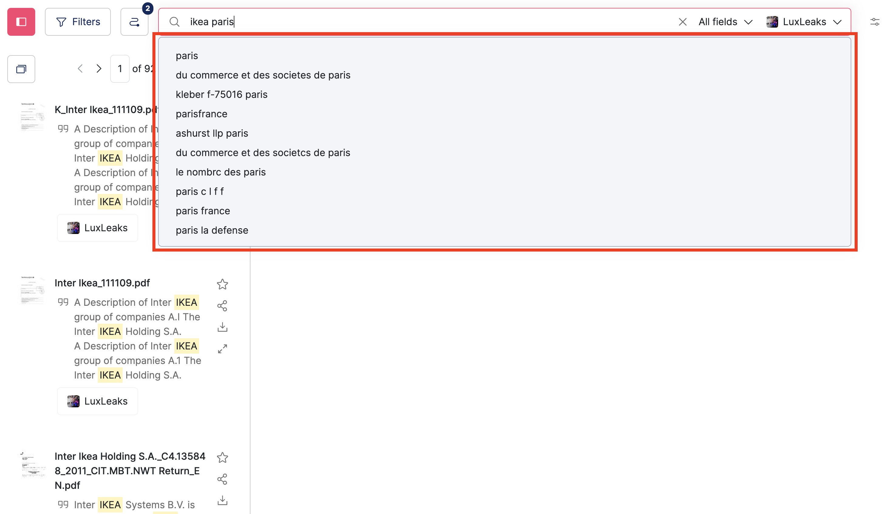<figcaption></figcaption></figure>

## Search in a field

Search within a specific field only, by using the dropdown '**All fields**':

<figure>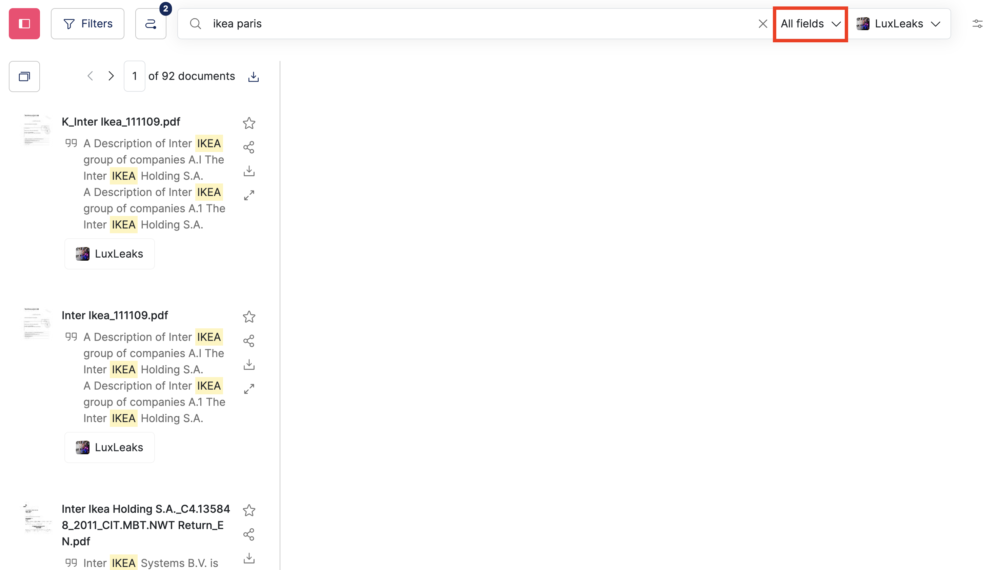<figcaption></figcaption></figure>

<figure>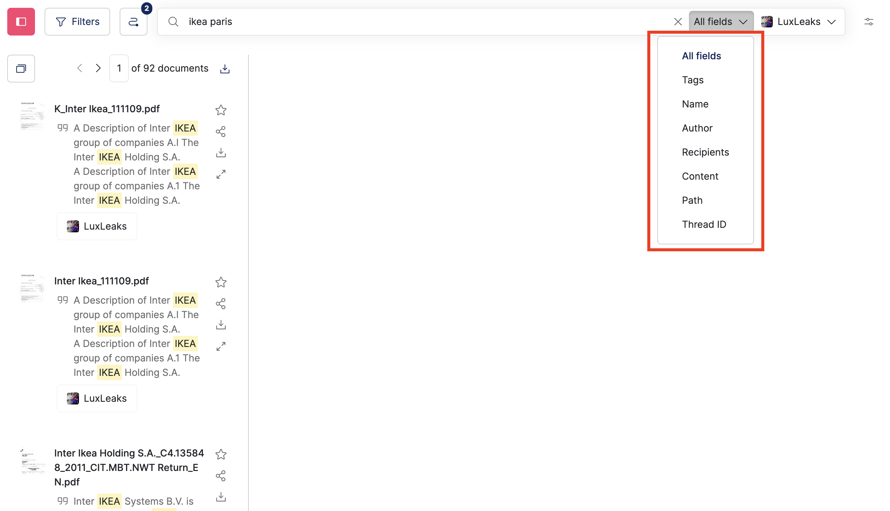<figcaption></figcaption></figure>

## Search breadcrumb

To see your queries in the **search breadcrumb**, click on the icon on the left of the search bar:

<figure>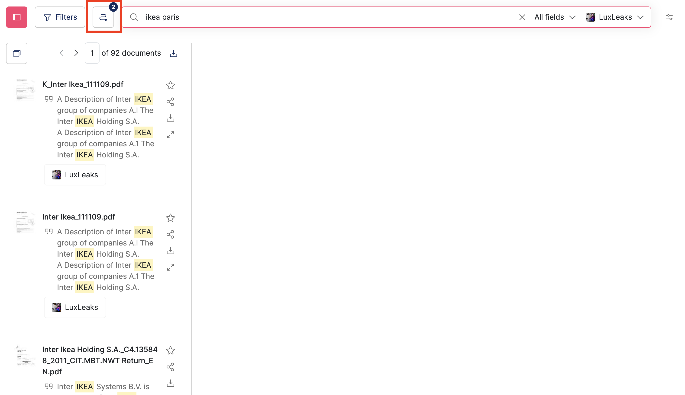<figcaption></figcaption></figure>

<figure>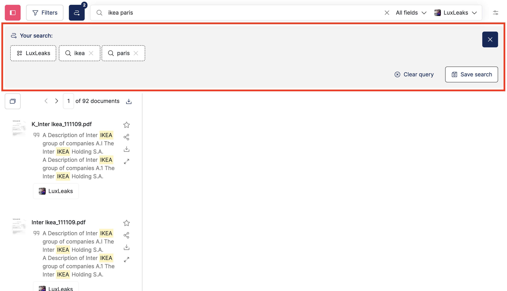<figcaption></figcaption></figure>

If you'd like to remove all searched terms from the search bar, click '**Clear query**':

<figure>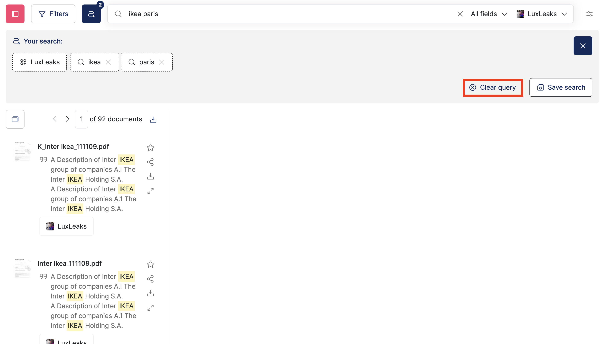<figcaption></figcaption></figure>

## Results settings

To change the page settings, click the **Settings icon** on the top right:

<figure>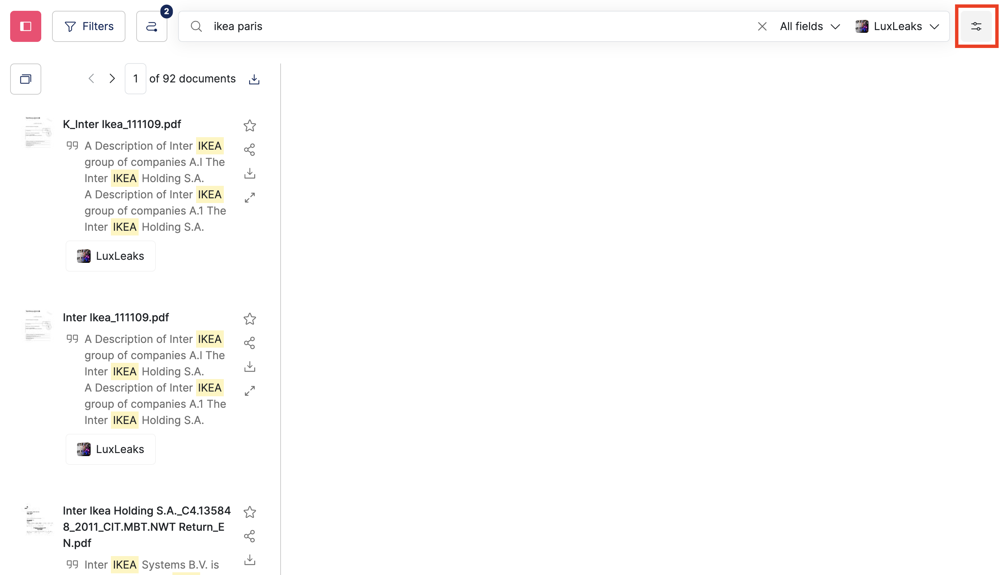<figcaption></figcaption></figure>

<figure>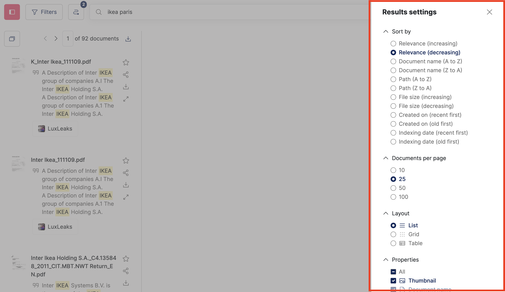<figcaption></figcaption></figure>

You can change **Sort by**, **Documents per page**, **Layout** and also **Properties**:

<figure>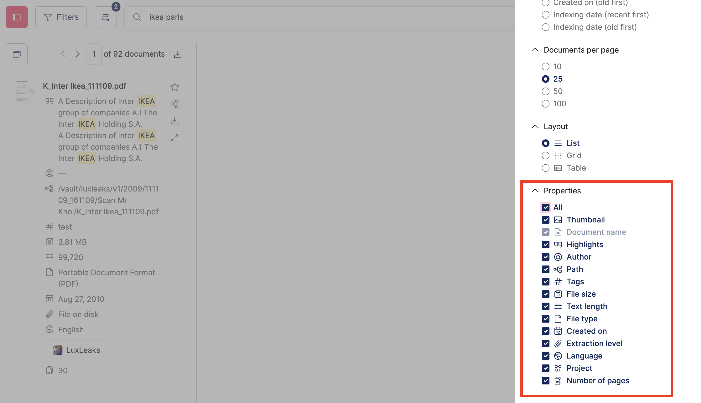<figcaption></figcaption></figure>

Ticking these properties will change **which document's metadata are displayed in the results**, in the document cards, in all 3 layouts (List, Grid, Table):

<figure>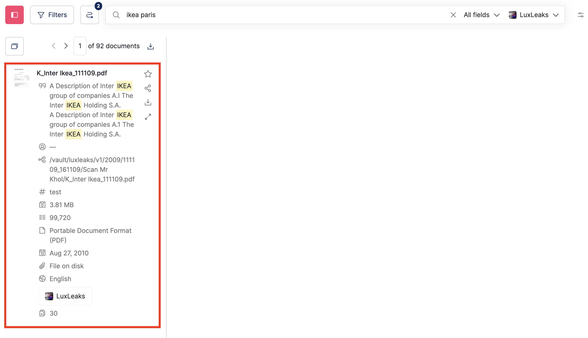<figcaption></figcaption></figure>

<figure>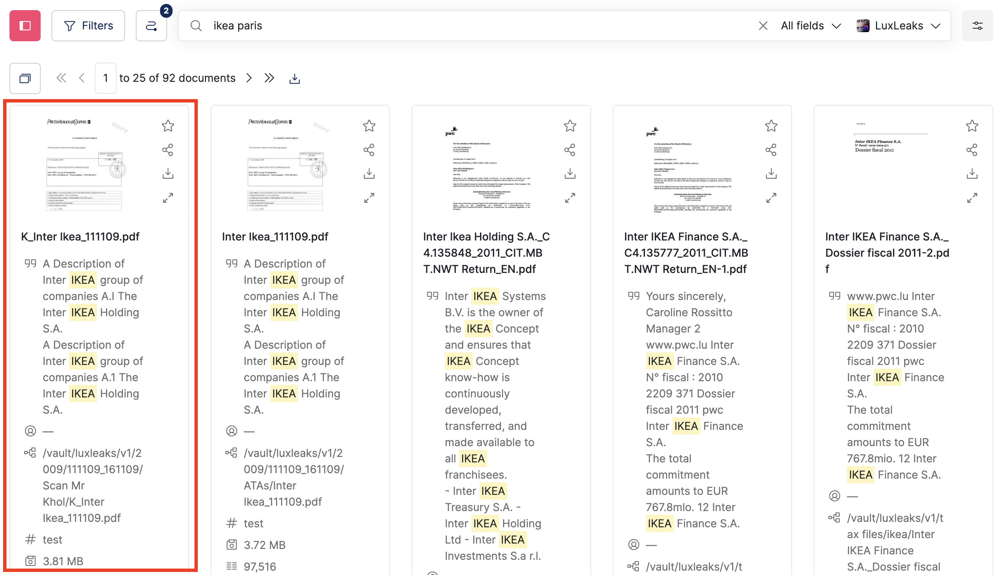<figcaption></figcaption></figure>

<figure>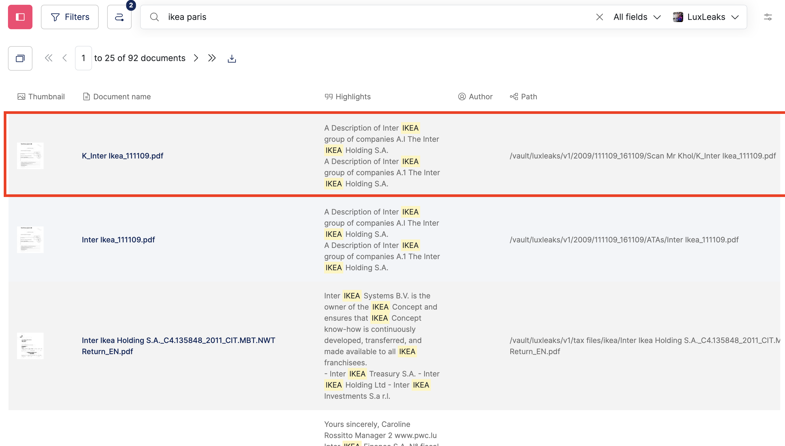<figcaption></figcaption></figure>

You can now make your search more precise [with operators or Regex (Regular Expressions)](search-with-operators.md).

## **Characters that cannot be searched**

Some characters **cannot be found** in Datashare, even if you can see them in your documents. This includes most **symbols and punctuation marks**, for instance:

> $ € £ ¥ % # @ & + = , ; ! ? ( ) « » " ' / –

This is because Datashare uses [the Standard tokenizer](https://www.elastic.co/guide/en/elasticsearch/reference/current/analysis-standard-tokenizer.html). When your documents are indexed, their text is split into **terms** (mostly words and numbers), and **most symbols and punctuation are removed**. These characters are not stored in the index, so the search engine cannot find them.


**Why does it work this way?** The Standard tokenizer follows [Unicode's rules for splitting text into words](https://unicode.org/reports/tr29/). It is designed to find **words**, whatever punctuation surrounds them. Thanks to this, searching for **contract** also finds "contract,", "(contract)" or "contract." without you having to think about it. It also keeps the index smaller, which helps make searches **faster**, especially on very large datasets.


A document containing "€ 2 million" is indexed as the terms **2** and **million**. The **€** is not kept.

The same thing happens to your query. If you search for:

> €

Datashare has no term to look for, and **returns no results**, even if many of your documents contain the euro sign.

**Escaping the character with a backslash (\€), using double quotes ("€") or using Regex (/€/) does not help:** the character is still not in the index.

#### **How to find these mentions anyway**

Instead of searching for the symbol, search for the **words or numbers around it**.

* Use an **exact phrase** with the amount, as the symbol is removed on both sides:

> "2 million" (this query will catch "€ 2 million", "€2 million", etc., with any currency)

* Use a **proximity search** if you don't know the exact amount:

> "million euros"\~2 (this query will catch "2 million euros", "1.5 million euros", etc.)

* Search for **other ways of writing** the same thing with <kbd>OR</kbd>. You need to write <kbd>OR</kbd> with **all letters uppercase:**

> EUR OR euro OR euros

* Use the <kbd>**AND**</kbd> operator to combine terms that **usually appear together** in the documents you are looking for:

> "2 million" AND contract

