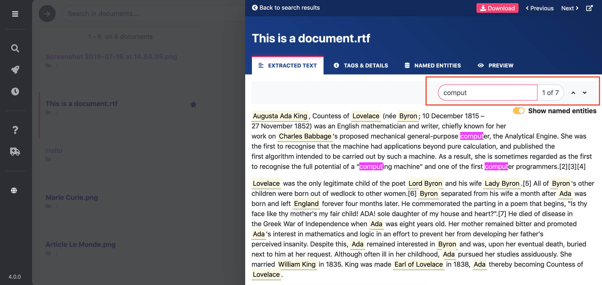

# Search documents

### Search in documents

&#x20;1\. To see all your documents (you need to have [added documents](https://icij.gitbook.io/datashare/mac/add-documents-to-datashare-on-mac) to Datashare and[ have analyzed](https://icij.gitbook.io/datashare/all/analyze-documents) them before), click '**Search in documents'**:

If not collapsed yet, to collapse the left menu in order to gain room, **click the 'hamburger menu'**:

&#x20;2\. Search for specific documents. **Type terms** in the search bar, **press Enter** or **click 'Search'**:

**IMPORTANT:**

* To make your searches more precise, you can **search with operators (AND, OR, ....):** [**read more here**](https://icij.gitbook.io/datashare/all/search-with-operators)**.**

* **If you get a message "Your search query is wrong", it is probably because you are misusing one or some reserved characters (like ^ " ? ( \[ \* OR AND etc).** [**Please refer to this page**](https://icij.gitbook.io/datashare/faq-errors/your-search-query-is-wrong)**.**

.png>)

&#x20;3\. You can search **in specific fields** like tags, title, author, recipient, content, path or thread ID. Click **'All fields**' and **select your choice** in the dropdown menu:

&#x20;

### Choose between views (list, grid, table)

Select the view on the top right.

* **List:**

* **Grid:**

* **Table:**

### Search within a document

Once a document is opened, you can **search for terms in this document:**

* Press **Command (⌘) + F** (on Mac) or **Control + F** (on Windows and Linux) or click on the search bar above your Extracted Text
* Type what you search for
* Press **ENTER** to go from one occurrence to the **next** one
* Presse **SHIFT + ENTER** to go from one occurrence to the **previous** one

_(To know all the shortcuts in Datashare, please read '_[_Use keyboard shortcuts_](https://icij.gitbook.io/datashare/all/use-keyboard-shortcuts)_'.)_

This also counts the number of occurrences of your searched terms in this document:

If you run [email extraction](https://icij.gitbook.io/datashare/all/analyze-documents#extract-email-addresses) and searched for one or several email addresses, if the email adresses are in the email's metadata (recipient, sender or other field), there will be a '**in metadata**' label attached to the email addresses:

