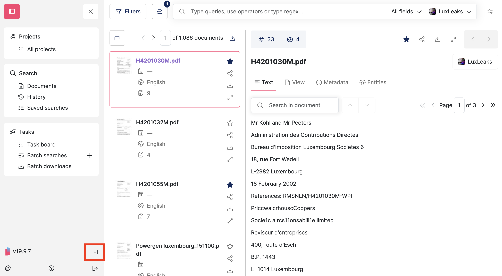
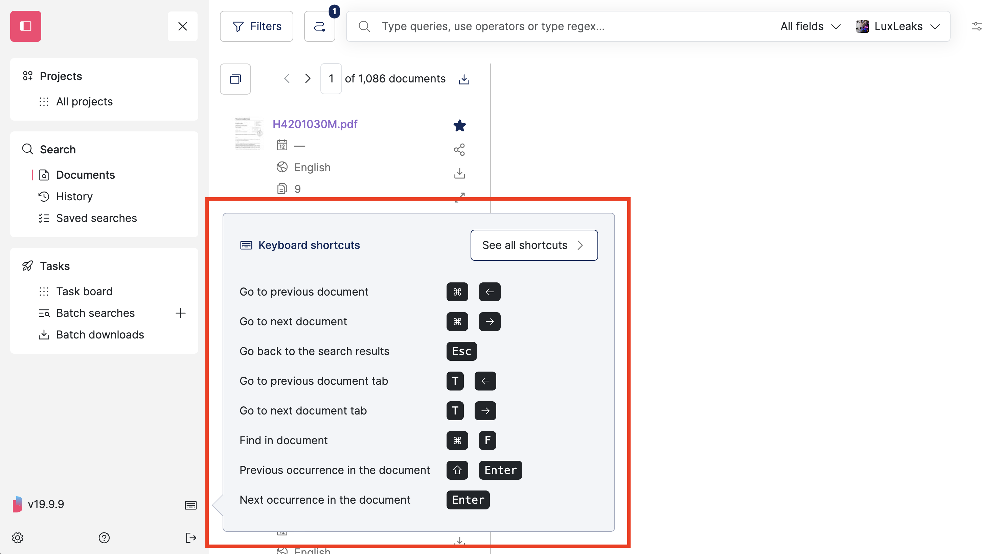
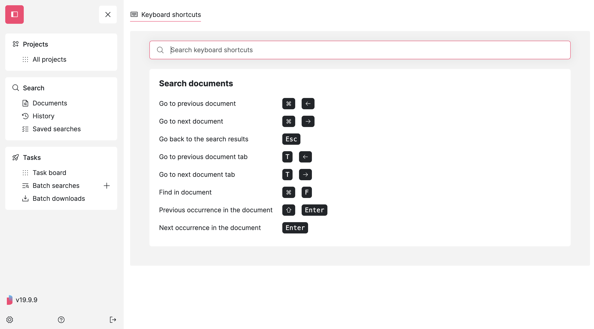

# Keyboard shortcuts

Open the **menu** > '**Search**' > '**Documents**' and click the **keyboard icon** at the bottom of the menu:

<figure><figcaption></figcaption></figure>

It opens a window with the **shortcuts for your OS** (Mac, Windows, Linux):

<figure><figcaption></figcaption></figure>

Click on '**See all shortcuts**' to reach the full page view:

<figure><figcaption></figcaption></figure>
